# Projects and dependencies analysis

This document provides a comprehensive overview of the projects and their dependencies in the context of upgrading to .NETCoreApp,Version=v10.0.

## Table of Contents

- [Executive Summary](#executive-Summary)
  - [Highlevel Metrics](#highlevel-metrics)
  - [Projects Compatibility](#projects-compatibility)
  - [Package Compatibility](#package-compatibility)
  - [API Compatibility](#api-compatibility)
  - [Binding Redirect Configuration](#binding-redirect-configuration)
- [Aggregate NuGet packages details](#aggregate-nuget-packages-details)
- [Top API Migration Challenges](#top-api-migration-challenges)
  - [Technologies and Features](#technologies-and-features)
  - [Most Frequent API Issues](#most-frequent-api-issues)
- [Projects Relationship Graph](#projects-relationship-graph)
- [Project Details](#project-details)

  - [Samples\Client.Net4\UA Sample Client.csproj](#samplesclientnet4ua-sample-clientcsproj)
  - [Samples\ClientControls.Net4\UA Client Controls.csproj](#samplesclientcontrolsnet4ua-client-controlscsproj)
  - [Samples\Controls.Net4\UA Sample Controls.csproj](#samplescontrolsnet4ua-sample-controlscsproj)
  - [Samples\GDS\Client\GlobalDiscoveryClient.csproj](#samplesgdsclientglobaldiscoveryclientcsproj)
  - [Samples\GDS\ClientControls\GlobalDiscoveryClientControls.csproj](#samplesgdsclientcontrolsglobaldiscoveryclientcontrolscsproj)
  - [Samples\GDS\ConsoleServer\NetCoreGlobalDiscoveryServer.csproj](#samplesgdsconsoleservernetcoreglobaldiscoveryservercsproj)
  - [Samples\GDS\Server\GlobalDiscoveryServer.csproj](#samplesgdsserverglobaldiscoveryservercsproj)
  - [Samples\Opc.Ua.Sample\Opc.Ua.Sample.csproj](#samplesopcuasampleopcuasamplecsproj)
  - [Samples\ReferenceClient\Reference Client.csproj](#samplesreferenceclientreference-clientcsproj)
  - [Samples\ReferenceServer\Reference Server.csproj](#samplesreferenceserverreference-servercsproj)
  - [Samples\Server.Net4\UA Sample Server.csproj](#samplesservernet4ua-sample-servercsproj)
  - [Samples\ServerControls.Net4\UA Server Controls.csproj](#samplesservercontrolsnet4ua-server-controlscsproj)
  - [Workshop\Aggregation\Client\Aggregation Client.csproj](#workshopaggregationclientaggregation-clientcsproj)
  - [Workshop\Aggregation\ConsoleAggregationServer\ConsoleAggregationServer.csproj](#workshopaggregationconsoleaggregationserverconsoleaggregationservercsproj)
  - [Workshop\Aggregation\Server\Aggregation Server.csproj](#workshopaggregationserveraggregation-servercsproj)
  - [Workshop\AlarmCondition\Client\AlarmCondition Client.csproj](#workshopalarmconditionclientalarmcondition-clientcsproj)
  - [Workshop\AlarmCondition\Server\AlarmCondition Server.csproj](#workshopalarmconditionserveralarmcondition-servercsproj)
  - [Workshop\Boiler\Client\Boiler Client.csproj](#workshopboilerclientboiler-clientcsproj)
  - [Workshop\Boiler\Server\Boiler Server.csproj](#workshopboilerserverboiler-servercsproj)
  - [Workshop\Common\Quickstart Library.csproj](#workshopcommonquickstart-librarycsproj)
  - [Workshop\DataAccess\Client\DataAccess Client.csproj](#workshopdataaccessclientdataaccess-clientcsproj)
  - [Workshop\DataAccess\Server\DataAccess Server.csproj](#workshopdataaccessserverdataaccess-servercsproj)
  - [Workshop\DataTypes\Client\DataTypes Client.csproj](#workshopdatatypesclientdatatypes-clientcsproj)
  - [Workshop\DataTypes\Common\DataTypes Library.csproj](#workshopdatatypescommondatatypes-librarycsproj)
  - [Workshop\DataTypes\Server\DataTypes Server.csproj](#workshopdatatypesserverdatatypes-servercsproj)
  - [Workshop\Empty\Client\Empty Client.csproj](#workshopemptyclientempty-clientcsproj)
  - [Workshop\Empty\Server\Empty Server.csproj](#workshopemptyserverempty-servercsproj)
  - [Workshop\HistoricalAccess\Client\HistoricalAccess Client.csproj](#workshophistoricalaccessclienthistoricalaccess-clientcsproj)
  - [Workshop\HistoricalAccess\Server\HistoricalAccess Server.csproj](#workshophistoricalaccessserverhistoricalaccess-servercsproj)
  - [Workshop\HistoricalAccess\Tester\Aggregate Tester.csproj](#workshophistoricalaccesstesteraggregate-testercsproj)
  - [Workshop\HistoricalEvents\Client\HistoricalEvents Client.csproj](#workshophistoricaleventsclienthistoricalevents-clientcsproj)
  - [Workshop\HistoricalEvents\Server\HistoricalEvents Server.csproj](#workshophistoricaleventsserverhistoricalevents-servercsproj)
  - [Workshop\Methods\Client\Methods Client.csproj](#workshopmethodsclientmethods-clientcsproj)
  - [Workshop\Methods\Server\Methods Server.csproj](#workshopmethodsservermethods-servercsproj)
  - [Workshop\PerfTest\Client\PerfTest Client.csproj](#workshopperftestclientperftest-clientcsproj)
  - [Workshop\PerfTest\Server\PerfTest Server.csproj](#workshopperftestserverperftest-servercsproj)
  - [Workshop\SimpleEvents\Client\SimpleEvents Client.csproj](#workshopsimpleeventsclientsimpleevents-clientcsproj)
  - [Workshop\SimpleEvents\Server\SimpleEvents Server.csproj](#workshopsimpleeventsserversimpleevents-servercsproj)
  - [Workshop\UserAuthentication\Client\UserAuthentication Client.csproj](#workshopuserauthenticationclientuserauthentication-clientcsproj)
  - [Workshop\UserAuthentication\Server\UserAuthentication Server.csproj](#workshopuserauthenticationserveruserauthentication-servercsproj)
  - [Workshop\Views\Client\Views Client.csproj](#workshopviewsclientviews-clientcsproj)
  - [Workshop\Views\Server\Views Server.csproj](#workshopviewsserverviews-servercsproj)


## Executive Summary

### Highlevel Metrics

| Metric | Count | Status |
| :--- | :---: | :--- |
| Total Projects | 42 | 41 require upgrade |
| Total NuGet Packages | 24 | 4 need upgrade |
| Total Code Files | 782 |  |
| Total Code Files with Incidents | 587 |  |
| Total Lines of Code | 230925 |  |
| Total Number of Issues | 88453 |  |
| Estimated LOC to modify | 88286+ | at least 38,2% of codebase |

### Projects Compatibility

| Project | Target Framework | Difficulty | Package Issues | API Issues | Binding Issues | Est. LOC Impact | Description |
| :--- | :---: | :---: | :---: | :---: | :---: | :---: | :--- |
| [Samples\Client.Net4\UA Sample Client.csproj](#samplesclientnet4ua-sample-clientcsproj) | net48 | 🟢 Low | 4 | 21 | 0 | 21+ | ClassicWinForms, Sdk Style = False |
| [Samples\ClientControls.Net4\UA Client Controls.csproj](#samplesclientcontrolsnet4ua-client-controlscsproj) | net48 | 🟡 Medium | 2 | 32412 | 0 | 32412+ | ClassicWinForms, Sdk Style = False |
| [Samples\Controls.Net4\UA Sample Controls.csproj](#samplescontrolsnet4ua-sample-controlscsproj) | net48 | 🟡 Medium | 2 | 20559 | 0 | 20559+ | ClassicWinForms, Sdk Style = False |
| [Samples\GDS\Client\GlobalDiscoveryClient.csproj](#samplesgdsclientglobaldiscoveryclientcsproj) | net48 | 🟡 Medium | 2 | 5577 | 0 | 5577+ | ClassicWinForms, Sdk Style = False |
| [Samples\GDS\ClientControls\GlobalDiscoveryClientControls.csproj](#samplesgdsclientcontrolsglobaldiscoveryclientcontrolscsproj) | net48 | 🟡 Medium | 2 | 8895 | 0 | 8895+ | ClassicWinForms, Sdk Style = False |
| [Samples\GDS\ConsoleServer\NetCoreGlobalDiscoveryServer.csproj](#samplesgdsconsoleservernetcoreglobaldiscoveryservercsproj) | net10.0 | ✅ None | 0 | 0 | 0 |  | DotNetCoreApp, Sdk Style = True |
| [Samples\GDS\Server\GlobalDiscoveryServer.csproj](#samplesgdsserverglobaldiscoveryservercsproj) | net48 | 🟢 Low | 3 | 12 | 0 | 12+ | ClassicWinForms, Sdk Style = False |
| [Samples\Opc.Ua.Sample\Opc.Ua.Sample.csproj](#samplesopcuasampleopcuasamplecsproj) | net48;netstandard2.1;net8.0;net10.0 | 🟢 Low | 2 | 0 | 0 |  | ClassLibrary, Sdk Style = True |
| [Samples\ReferenceClient\Reference Client.csproj](#samplesreferenceclientreference-clientcsproj) | net48 | 🟡 Medium | 2 | 260 | 0 | 260+ | ClassicWinForms, Sdk Style = False |
| [Samples\ReferenceServer\Reference Server.csproj](#samplesreferenceserverreference-servercsproj) | net48 | 🟡 Medium | 2 | 306 | 0 | 306+ | ClassicWinForms, Sdk Style = False |
| [Samples\Server.Net4\UA Sample Server.csproj](#samplesservernet4ua-sample-servercsproj) | net48 | 🟡 Medium | 3 | 785 | 0 | 785+ | ClassicWinForms, Sdk Style = False |
| [Samples\ServerControls.Net4\UA Server Controls.csproj](#samplesservercontrolsnet4ua-server-controlscsproj) | net48 | 🟡 Medium | 2 | 1464 | 0 | 1464+ | ClassicWinForms, Sdk Style = False |
| [Workshop\Aggregation\Client\Aggregation Client.csproj](#workshopaggregationclientaggregation-clientcsproj) | net48 | 🟡 Medium | 2 | 1230 | 0 | 1230+ | ClassicWinForms, Sdk Style = False |
| [Workshop\Aggregation\ConsoleAggregationServer\ConsoleAggregationServer.csproj](#workshopaggregationconsoleaggregationserverconsoleaggregationservercsproj) | net8.0 | 🟢 Low | 3 | 10 | 0 | 10+ | DotNetCoreApp, Sdk Style = True |
| [Workshop\Aggregation\Server\Aggregation Server.csproj](#workshopaggregationserveraggregation-servercsproj) | net48 | 🟢 Low | 2 | 16 | 0 | 16+ | ClassicWinForms, Sdk Style = False |
| [Workshop\AlarmCondition\Client\AlarmCondition Client.csproj](#workshopalarmconditionclientalarmcondition-clientcsproj) | net48 | 🟡 Medium | 2 | 2581 | 0 | 2581+ | ClassicWinForms, Sdk Style = False |
| [Workshop\AlarmCondition\Server\AlarmCondition Server.csproj](#workshopalarmconditionserveralarmcondition-servercsproj) | net48 | 🟢 Low | 2 | 10 | 0 | 10+ | ClassicWinForms, Sdk Style = False |
| [Workshop\Boiler\Client\Boiler Client.csproj](#workshopboilerclientboiler-clientcsproj) | net48 | 🟡 Medium | 2 | 466 | 0 | 466+ | ClassicWinForms, Sdk Style = False |
| [Workshop\Boiler\Server\Boiler Server.csproj](#workshopboilerserverboiler-servercsproj) | net48 | 🟢 Low | 2 | 10 | 0 | 10+ | ClassicWinForms, Sdk Style = False |
| [Workshop\Common\Quickstart Library.csproj](#workshopcommonquickstart-librarycsproj) | net48 | 🟡 Medium | 2 | 212 | 0 | 212+ | ClassicWinForms, Sdk Style = False |
| [Workshop\DataAccess\Client\DataAccess Client.csproj](#workshopdataaccessclientdataaccess-clientcsproj) | net48 | 🟡 Medium | 2 | 2609 | 0 | 2609+ | ClassicWinForms, Sdk Style = False |
| [Workshop\DataAccess\Server\DataAccess Server.csproj](#workshopdataaccessserverdataaccess-servercsproj) | net48 | 🟢 Low | 2 | 10 | 0 | 10+ | ClassicWinForms, Sdk Style = False |
| [Workshop\DataTypes\Client\DataTypes Client.csproj](#workshopdatatypesclientdatatypes-clientcsproj) | net48 | 🟡 Medium | 2 | 306 | 0 | 306+ | ClassicWinForms, Sdk Style = False |
| [Workshop\DataTypes\Common\DataTypes Library.csproj](#workshopdatatypescommondatatypes-librarycsproj) | net48 | 🟢 Low | 2 | 0 | 0 |  | ClassicClassLibrary, Sdk Style = False |
| [Workshop\DataTypes\Server\DataTypes Server.csproj](#workshopdatatypesserverdatatypes-servercsproj) | net48 | 🟢 Low | 2 | 10 | 0 | 10+ | ClassicWinForms, Sdk Style = False |
| [Workshop\Empty\Client\Empty Client.csproj](#workshopemptyclientempty-clientcsproj) | net48 | 🟡 Medium | 2 | 253 | 0 | 253+ | ClassicWinForms, Sdk Style = False |
| [Workshop\Empty\Server\Empty Server.csproj](#workshopemptyserverempty-servercsproj) | net48 | 🟢 Low | 2 | 10 | 0 | 10+ | ClassicWinForms, Sdk Style = False |
| [Workshop\HistoricalAccess\Client\HistoricalAccess Client.csproj](#workshophistoricalaccessclienthistoricalaccess-clientcsproj) | net48 | 🟡 Medium | 2 | 1584 | 0 | 1584+ | ClassicWinForms, Sdk Style = False |
| [Workshop\HistoricalAccess\Server\HistoricalAccess Server.csproj](#workshophistoricalaccessserverhistoricalaccess-servercsproj) | net48 | 🟢 Low | 2 | 10 | 0 | 10+ | ClassicWinForms, Sdk Style = False |
| [Workshop\HistoricalAccess\Tester\Aggregate Tester.csproj](#workshophistoricalaccesstesteraggregate-testercsproj) | net48 | 🟡 Medium | 2 | 1832 | 0 | 1832+ | ClassicWinForms, Sdk Style = False |
| [Workshop\HistoricalEvents\Client\HistoricalEvents Client.csproj](#workshophistoricaleventsclienthistoricalevents-clientcsproj) | net48 | 🟡 Medium | 2 | 3154 | 0 | 3154+ | ClassicWinForms, Sdk Style = False |
| [Workshop\HistoricalEvents\Server\HistoricalEvents Server.csproj](#workshophistoricaleventsserverhistoricalevents-servercsproj) | net48 | 🟢 Low | 2 | 12 | 0 | 12+ | ClassicWinForms, Sdk Style = False |
| [Workshop\Methods\Client\Methods Client.csproj](#workshopmethodsclientmethods-clientcsproj) | net48 | 🟡 Medium | 2 | 491 | 0 | 491+ | ClassicWinForms, Sdk Style = False |
| [Workshop\Methods\Server\Methods Server.csproj](#workshopmethodsservermethods-servercsproj) | net48 | 🟢 Low | 2 | 10 | 0 | 10+ | ClassicWinForms, Sdk Style = False |
| [Workshop\PerfTest\Client\PerfTest Client.csproj](#workshopperftestclientperftest-clientcsproj) | net48 | 🟡 Medium | 2 | 618 | 0 | 618+ | ClassicWinForms, Sdk Style = False |
| [Workshop\PerfTest\Server\PerfTest Server.csproj](#workshopperftestserverperftest-servercsproj) | net48 | 🟢 Low | 2 | 6 | 0 | 6+ | ClassicWinForms, Sdk Style = False |
| [Workshop\SimpleEvents\Client\SimpleEvents Client.csproj](#workshopsimpleeventsclientsimpleevents-clientcsproj) | net48 | 🟡 Medium | 2 | 744 | 0 | 744+ | ClassicWinForms, Sdk Style = False |
| [Workshop\SimpleEvents\Server\SimpleEvents Server.csproj](#workshopsimpleeventsserversimpleevents-servercsproj) | net48 | 🟢 Low | 2 | 10 | 0 | 10+ | ClassicWinForms, Sdk Style = False |
| [Workshop\UserAuthentication\Client\UserAuthentication Client.csproj](#workshopuserauthenticationclientuserauthentication-clientcsproj) | net48 | 🟡 Medium | 2 | 1349 | 0 | 1349+ | ClassicWinForms, Sdk Style = False |
| [Workshop\UserAuthentication\Server\UserAuthentication Server.csproj](#workshopuserauthenticationserveruserauthentication-servercsproj) | net48 | 🟢 Low | 2 | 41 | 0 | 41+ | ClassicWinForms, Sdk Style = False |
| [Workshop\Views\Client\Views Client.csproj](#workshopviewsclientviews-clientcsproj) | net48 | 🟡 Medium | 2 | 391 | 0 | 391+ | ClassicWinForms, Sdk Style = False |
| [Workshop\Views\Server\Views Server.csproj](#workshopviewsserverviews-servercsproj) | net48 | 🟢 Low | 2 | 10 | 0 | 10+ | ClassicWinForms, Sdk Style = False |

### Package Compatibility

| Status | Count | Percentage |
| :--- | :---: | :---: |
| ✅ Compatible | 20 | 83,3% |
| ⚠️ Incompatible | 1 | 4,2% |
| 🔄 Upgrade Recommended | 3 | 12,5% |
| ***Total NuGet Packages*** | ***24*** | ***100%*** |

### API Compatibility

| Category | Count | Impact |
| :--- | :---: | :--- |
| 🔴 Binary Incompatible | 85791 | High - Require code changes |
| 🟡 Source Incompatible | 2334 | Medium - Needs re-compilation and potential conflicting API error fixing |
| 🔵 Behavioral change | 161 | Low - Behavioral changes that may require testing at runtime |
| ✅ Compatible | 209972 |  |
| ***Total APIs Analyzed*** | ***298258*** |  |

## Aggregate NuGet packages details

| Package | Current Version | Suggested Version | Projects | Description |
| :--- | :---: | :---: | :--- | :--- |
| EntityFramework | 6.5.1 | 6.5.2 | [GlobalDiscoveryServer.csproj](#samplesgdsserverglobaldiscoveryservercsproj) | NuGet package upgrade is recommended |
| Microsoft.CodeAnalysis.NetAnalyzers | 9.0.0 |  | [Aggregate Tester.csproj](#workshophistoricalaccesstesteraggregate-testercsproj)<br/>[Aggregation Client.csproj](#workshopaggregationclientaggregation-clientcsproj)<br/>[Aggregation Server.csproj](#workshopaggregationserveraggregation-servercsproj)<br/>[AlarmCondition Client.csproj](#workshopalarmconditionclientalarmcondition-clientcsproj)<br/>[AlarmCondition Server.csproj](#workshopalarmconditionserveralarmcondition-servercsproj)<br/>[Boiler Client.csproj](#workshopboilerclientboiler-clientcsproj)<br/>[Boiler Server.csproj](#workshopboilerserverboiler-servercsproj)<br/>[ConsoleAggregationServer.csproj](#workshopaggregationconsoleaggregationserverconsoleaggregationservercsproj)<br/>[DataAccess Client.csproj](#workshopdataaccessclientdataaccess-clientcsproj)<br/>[DataAccess Server.csproj](#workshopdataaccessserverdataaccess-servercsproj)<br/>[DataTypes Client.csproj](#workshopdatatypesclientdatatypes-clientcsproj)<br/>[DataTypes Library.csproj](#workshopdatatypescommondatatypes-librarycsproj)<br/>[DataTypes Server.csproj](#workshopdatatypesserverdatatypes-servercsproj)<br/>[Empty Client.csproj](#workshopemptyclientempty-clientcsproj)<br/>[Empty Server.csproj](#workshopemptyserverempty-servercsproj)<br/>[GlobalDiscoveryClient.csproj](#samplesgdsclientglobaldiscoveryclientcsproj)<br/>[GlobalDiscoveryClientControls.csproj](#samplesgdsclientcontrolsglobaldiscoveryclientcontrolscsproj)<br/>[GlobalDiscoveryServer.csproj](#samplesgdsserverglobaldiscoveryservercsproj)<br/>[HistoricalAccess Client.csproj](#workshophistoricalaccessclienthistoricalaccess-clientcsproj)<br/>[HistoricalAccess Server.csproj](#workshophistoricalaccessserverhistoricalaccess-servercsproj)<br/>[HistoricalEvents Client.csproj](#workshophistoricaleventsclienthistoricalevents-clientcsproj)<br/>[HistoricalEvents Server.csproj](#workshophistoricaleventsserverhistoricalevents-servercsproj)<br/>[Methods Client.csproj](#workshopmethodsclientmethods-clientcsproj)<br/>[Methods Server.csproj](#workshopmethodsservermethods-servercsproj)<br/>[NetCoreGlobalDiscoveryServer.csproj](#samplesgdsconsoleservernetcoreglobaldiscoveryservercsproj)<br/>[Opc.Ua.Sample.csproj](#samplesopcuasampleopcuasamplecsproj)<br/>[PerfTest Client.csproj](#workshopperftestclientperftest-clientcsproj)<br/>[PerfTest Server.csproj](#workshopperftestserverperftest-servercsproj)<br/>[Quickstart Library.csproj](#workshopcommonquickstart-librarycsproj)<br/>[Reference Client.csproj](#samplesreferenceclientreference-clientcsproj)<br/>[Reference Server.csproj](#samplesreferenceserverreference-servercsproj)<br/>[SimpleEvents Client.csproj](#workshopsimpleeventsclientsimpleevents-clientcsproj)<br/>[SimpleEvents Server.csproj](#workshopsimpleeventsserversimpleevents-servercsproj)<br/>[UA Client Controls.csproj](#samplesclientcontrolsnet4ua-client-controlscsproj)<br/>[UA Sample Client.csproj](#samplesclientnet4ua-sample-clientcsproj)<br/>[UA Sample Controls.csproj](#samplescontrolsnet4ua-sample-controlscsproj)<br/>[UA Sample Server.csproj](#samplesservernet4ua-sample-servercsproj)<br/>[UA Server Controls.csproj](#samplesservercontrolsnet4ua-server-controlscsproj)<br/>[UserAuthentication Client.csproj](#workshopuserauthenticationclientuserauthentication-clientcsproj)<br/>[UserAuthentication Server.csproj](#workshopuserauthenticationserveruserauthentication-servercsproj)<br/>[Views Client.csproj](#workshopviewsclientviews-clientcsproj)<br/>[Views Server.csproj](#workshopviewsserverviews-servercsproj) | ✅Compatible |
| Microsoft.Extensions.Logging.Abstractions | 10.0.8 | 10.0.10 | [UA Sample Client.csproj](#samplesclientnet4ua-sample-clientcsproj)<br/>[UA Sample Server.csproj](#samplesservernet4ua-sample-servercsproj) | NuGet package upgrade is recommended |
| Microsoft.Extensions.Logging.Console | 10.0.8 | 10.0.10 | [Aggregate Tester.csproj](#workshophistoricalaccesstesteraggregate-testercsproj)<br/>[Aggregation Client.csproj](#workshopaggregationclientaggregation-clientcsproj)<br/>[Aggregation Server.csproj](#workshopaggregationserveraggregation-servercsproj)<br/>[AlarmCondition Client.csproj](#workshopalarmconditionclientalarmcondition-clientcsproj)<br/>[AlarmCondition Server.csproj](#workshopalarmconditionserveralarmcondition-servercsproj)<br/>[Boiler Client.csproj](#workshopboilerclientboiler-clientcsproj)<br/>[Boiler Server.csproj](#workshopboilerserverboiler-servercsproj)<br/>[ConsoleAggregationServer.csproj](#workshopaggregationconsoleaggregationserverconsoleaggregationservercsproj)<br/>[DataAccess Client.csproj](#workshopdataaccessclientdataaccess-clientcsproj)<br/>[DataAccess Server.csproj](#workshopdataaccessserverdataaccess-servercsproj)<br/>[DataTypes Client.csproj](#workshopdatatypesclientdatatypes-clientcsproj)<br/>[DataTypes Library.csproj](#workshopdatatypescommondatatypes-librarycsproj)<br/>[DataTypes Server.csproj](#workshopdatatypesserverdatatypes-servercsproj)<br/>[Empty Client.csproj](#workshopemptyclientempty-clientcsproj)<br/>[Empty Server.csproj](#workshopemptyserverempty-servercsproj)<br/>[GlobalDiscoveryClient.csproj](#samplesgdsclientglobaldiscoveryclientcsproj)<br/>[GlobalDiscoveryClientControls.csproj](#samplesgdsclientcontrolsglobaldiscoveryclientcontrolscsproj)<br/>[GlobalDiscoveryServer.csproj](#samplesgdsserverglobaldiscoveryservercsproj)<br/>[HistoricalAccess Client.csproj](#workshophistoricalaccessclienthistoricalaccess-clientcsproj)<br/>[HistoricalAccess Server.csproj](#workshophistoricalaccessserverhistoricalaccess-servercsproj)<br/>[HistoricalEvents Client.csproj](#workshophistoricaleventsclienthistoricalevents-clientcsproj)<br/>[HistoricalEvents Server.csproj](#workshophistoricaleventsserverhistoricalevents-servercsproj)<br/>[Methods Client.csproj](#workshopmethodsclientmethods-clientcsproj)<br/>[Methods Server.csproj](#workshopmethodsservermethods-servercsproj)<br/>[NetCoreGlobalDiscoveryServer.csproj](#samplesgdsconsoleservernetcoreglobaldiscoveryservercsproj)<br/>[Opc.Ua.Sample.csproj](#samplesopcuasampleopcuasamplecsproj)<br/>[PerfTest Client.csproj](#workshopperftestclientperftest-clientcsproj)<br/>[PerfTest Server.csproj](#workshopperftestserverperftest-servercsproj)<br/>[Quickstart Library.csproj](#workshopcommonquickstart-librarycsproj)<br/>[Reference Client.csproj](#samplesreferenceclientreference-clientcsproj)<br/>[Reference Server.csproj](#samplesreferenceserverreference-servercsproj)<br/>[SimpleEvents Client.csproj](#workshopsimpleeventsclientsimpleevents-clientcsproj)<br/>[SimpleEvents Server.csproj](#workshopsimpleeventsserversimpleevents-servercsproj)<br/>[UA Client Controls.csproj](#samplesclientcontrolsnet4ua-client-controlscsproj)<br/>[UA Sample Client.csproj](#samplesclientnet4ua-sample-clientcsproj)<br/>[UA Sample Controls.csproj](#samplescontrolsnet4ua-sample-controlscsproj)<br/>[UA Sample Server.csproj](#samplesservernet4ua-sample-servercsproj)<br/>[UA Server Controls.csproj](#samplesservercontrolsnet4ua-server-controlscsproj)<br/>[UserAuthentication Client.csproj](#workshopuserauthenticationclientuserauthentication-clientcsproj)<br/>[UserAuthentication Server.csproj](#workshopuserauthenticationserveruserauthentication-servercsproj)<br/>[Views Client.csproj](#workshopviewsclientviews-clientcsproj)<br/>[Views Server.csproj](#workshopviewsserverviews-servercsproj) | NuGet package upgrade is recommended |
| Microsoft.VisualStudio.Azure.Containers.Tools.Targets | 1.22.1 |  | [ConsoleAggregationServer.csproj](#workshopaggregationconsoleaggregationserverconsoleaggregationservercsproj)<br/>[NetCoreGlobalDiscoveryServer.csproj](#samplesgdsconsoleservernetcoreglobaldiscoveryservercsproj) | ⚠️NuGet package is incompatible |
| Mono.Options | 6.12.0.148 |  | [NetCoreGlobalDiscoveryServer.csproj](#samplesgdsconsoleservernetcoreglobaldiscoveryservercsproj) | ✅Compatible |
| OPCFoundation.NetStandard.Opc.Ua.Bindings.Https | 1.5.378.156 |  | [Reference Client.csproj](#samplesreferenceclientreference-clientcsproj)<br/>[Reference Server.csproj](#samplesreferenceserverreference-servercsproj)<br/>[UA Sample Client.csproj](#samplesclientnet4ua-sample-clientcsproj)<br/>[UA Sample Server.csproj](#samplesservernet4ua-sample-servercsproj) | ✅Compatible |
| OPCFoundation.NetStandard.Opc.Ua.Client | 1.5.378.156 |  | [Aggregate Tester.csproj](#workshophistoricalaccesstesteraggregate-testercsproj)<br/>[Aggregation Client.csproj](#workshopaggregationclientaggregation-clientcsproj)<br/>[Aggregation Server.csproj](#workshopaggregationserveraggregation-servercsproj)<br/>[Boiler Client.csproj](#workshopboilerclientboiler-clientcsproj)<br/>[DataAccess Client.csproj](#workshopdataaccessclientdataaccess-clientcsproj)<br/>[DataTypes Client.csproj](#workshopdatatypesclientdatatypes-clientcsproj)<br/>[Empty Client.csproj](#workshopemptyclientempty-clientcsproj)<br/>[GlobalDiscoveryClientControls.csproj](#samplesgdsclientcontrolsglobaldiscoveryclientcontrolscsproj)<br/>[HistoricalAccess Client.csproj](#workshophistoricalaccessclienthistoricalaccess-clientcsproj)<br/>[HistoricalEvents Client.csproj](#workshophistoricaleventsclienthistoricalevents-clientcsproj)<br/>[Methods Client.csproj](#workshopmethodsclientmethods-clientcsproj)<br/>[PerfTest Client.csproj](#workshopperftestclientperftest-clientcsproj)<br/>[Reference Client.csproj](#samplesreferenceclientreference-clientcsproj)<br/>[SimpleEvents Client.csproj](#workshopsimpleeventsclientsimpleevents-clientcsproj)<br/>[UA Client Controls.csproj](#samplesclientcontrolsnet4ua-client-controlscsproj)<br/>[UserAuthentication Client.csproj](#workshopuserauthenticationclientuserauthentication-clientcsproj)<br/>[Views Client.csproj](#workshopviewsclientviews-clientcsproj) | ✅Compatible |
| OPCFoundation.NetStandard.Opc.Ua.Client.ComplexTypes | 1.5.378.156 |  | [UA Client Controls.csproj](#samplesclientcontrolsnet4ua-client-controlscsproj)<br/>[UA Sample Controls.csproj](#samplescontrolsnet4ua-sample-controlscsproj) | ✅Compatible |
| OPCFoundation.NetStandard.Opc.Ua.Client.Debug | 1.5.378.156 |  | [ConsoleAggregationServer.csproj](#workshopaggregationconsoleaggregationserverconsoleaggregationservercsproj) | ✅Compatible |
| OPCFoundation.NetStandard.Opc.Ua.Configuration | 1.5.378.156 |  | [Aggregation Server.csproj](#workshopaggregationserveraggregation-servercsproj)<br/>[GlobalDiscoveryClient.csproj](#samplesgdsclientglobaldiscoveryclientcsproj)<br/>[GlobalDiscoveryServer.csproj](#samplesgdsserverglobaldiscoveryservercsproj)<br/>[NetCoreGlobalDiscoveryServer.csproj](#samplesgdsconsoleservernetcoreglobaldiscoveryservercsproj)<br/>[Reference Client.csproj](#samplesreferenceclientreference-clientcsproj)<br/>[Reference Server.csproj](#samplesreferenceserverreference-servercsproj)<br/>[UA Client Controls.csproj](#samplesclientcontrolsnet4ua-client-controlscsproj)<br/>[UA Server Controls.csproj](#samplesservercontrolsnet4ua-server-controlscsproj) | ✅Compatible |
| OPCFoundation.NetStandard.Opc.Ua.Configuration.Debug | 1.5.378.156 |  | [ConsoleAggregationServer.csproj](#workshopaggregationconsoleaggregationserverconsoleaggregationservercsproj) | ✅Compatible |
| OPCFoundation.NetStandard.Opc.Ua.Core | 1.5.378.156 |  | [Aggregation Server.csproj](#workshopaggregationserveraggregation-servercsproj)<br/>[DataTypes Library.csproj](#workshopdatatypescommondatatypes-librarycsproj)<br/>[Opc.Ua.Sample.csproj](#samplesopcuasampleopcuasamplecsproj)<br/>[Quickstart Library.csproj](#workshopcommonquickstart-librarycsproj)<br/>[Reference Client.csproj](#samplesreferenceclientreference-clientcsproj)<br/>[UA Client Controls.csproj](#samplesclientcontrolsnet4ua-client-controlscsproj)<br/>[UA Server Controls.csproj](#samplesservercontrolsnet4ua-server-controlscsproj) | ✅Compatible |
| OPCFoundation.NetStandard.Opc.Ua.Gds.Client.Common | 1.5.378.156 |  | [GlobalDiscoveryClient.csproj](#samplesgdsclientglobaldiscoveryclientcsproj)<br/>[GlobalDiscoveryClientControls.csproj](#samplesgdsclientcontrolsglobaldiscoveryclientcontrolscsproj) | ✅Compatible |
| OPCFoundation.NetStandard.Opc.Ua.Gds.Server.Common | 1.5.378.156 |  | [GlobalDiscoveryServer.csproj](#samplesgdsserverglobaldiscoveryservercsproj)<br/>[NetCoreGlobalDiscoveryServer.csproj](#samplesgdsconsoleservernetcoreglobaldiscoveryservercsproj) | ✅Compatible |
| OPCFoundation.NetStandard.Opc.Ua.Quickstarts.Servers | 1.5.378.156 |  | [Reference Server.csproj](#samplesreferenceserverreference-servercsproj) | ✅Compatible |
| OPCFoundation.NetStandard.Opc.Ua.Server | 1.5.378.156 |  | [Aggregate Tester.csproj](#workshophistoricalaccesstesteraggregate-testercsproj)<br/>[Aggregation Server.csproj](#workshopaggregationserveraggregation-servercsproj)<br/>[AlarmCondition Client.csproj](#workshopalarmconditionclientalarmcondition-clientcsproj)<br/>[AlarmCondition Server.csproj](#workshopalarmconditionserveralarmcondition-servercsproj)<br/>[Boiler Server.csproj](#workshopboilerserverboiler-servercsproj)<br/>[DataAccess Server.csproj](#workshopdataaccessserverdataaccess-servercsproj)<br/>[DataTypes Server.csproj](#workshopdatatypesserverdatatypes-servercsproj)<br/>[Empty Server.csproj](#workshopemptyserverempty-servercsproj)<br/>[HistoricalAccess Server.csproj](#workshophistoricalaccessserverhistoricalaccess-servercsproj)<br/>[HistoricalEvents Server.csproj](#workshophistoricaleventsserverhistoricalevents-servercsproj)<br/>[Methods Server.csproj](#workshopmethodsservermethods-servercsproj)<br/>[Opc.Ua.Sample.csproj](#samplesopcuasampleopcuasamplecsproj)<br/>[PerfTest Server.csproj](#workshopperftestserverperftest-servercsproj)<br/>[SimpleEvents Server.csproj](#workshopsimpleeventsserversimpleevents-servercsproj)<br/>[UA Sample Controls.csproj](#samplescontrolsnet4ua-sample-controlscsproj)<br/>[UA Server Controls.csproj](#samplesservercontrolsnet4ua-server-controlscsproj)<br/>[UserAuthentication Server.csproj](#workshopuserauthenticationserveruserauthentication-servercsproj)<br/>[Views Server.csproj](#workshopviewsserverviews-servercsproj) | ✅Compatible |
| OPCFoundation.NetStandard.Opc.Ua.Server.Debug | 1.5.378.152 |  | [ConsoleAggregationServer.csproj](#workshopaggregationconsoleaggregationserverconsoleaggregationservercsproj) | ✅Compatible |
| Roslynator.Analyzers | 4.14.0 |  | [Aggregate Tester.csproj](#workshophistoricalaccesstesteraggregate-testercsproj)<br/>[Aggregation Client.csproj](#workshopaggregationclientaggregation-clientcsproj)<br/>[Aggregation Server.csproj](#workshopaggregationserveraggregation-servercsproj)<br/>[AlarmCondition Client.csproj](#workshopalarmconditionclientalarmcondition-clientcsproj)<br/>[AlarmCondition Server.csproj](#workshopalarmconditionserveralarmcondition-servercsproj)<br/>[Boiler Client.csproj](#workshopboilerclientboiler-clientcsproj)<br/>[Boiler Server.csproj](#workshopboilerserverboiler-servercsproj)<br/>[ConsoleAggregationServer.csproj](#workshopaggregationconsoleaggregationserverconsoleaggregationservercsproj)<br/>[DataAccess Client.csproj](#workshopdataaccessclientdataaccess-clientcsproj)<br/>[DataAccess Server.csproj](#workshopdataaccessserverdataaccess-servercsproj)<br/>[DataTypes Client.csproj](#workshopdatatypesclientdatatypes-clientcsproj)<br/>[DataTypes Library.csproj](#workshopdatatypescommondatatypes-librarycsproj)<br/>[DataTypes Server.csproj](#workshopdatatypesserverdatatypes-servercsproj)<br/>[Empty Client.csproj](#workshopemptyclientempty-clientcsproj)<br/>[Empty Server.csproj](#workshopemptyserverempty-servercsproj)<br/>[GlobalDiscoveryClient.csproj](#samplesgdsclientglobaldiscoveryclientcsproj)<br/>[GlobalDiscoveryClientControls.csproj](#samplesgdsclientcontrolsglobaldiscoveryclientcontrolscsproj)<br/>[GlobalDiscoveryServer.csproj](#samplesgdsserverglobaldiscoveryservercsproj)<br/>[HistoricalAccess Client.csproj](#workshophistoricalaccessclienthistoricalaccess-clientcsproj)<br/>[HistoricalAccess Server.csproj](#workshophistoricalaccessserverhistoricalaccess-servercsproj)<br/>[HistoricalEvents Client.csproj](#workshophistoricaleventsclienthistoricalevents-clientcsproj)<br/>[HistoricalEvents Server.csproj](#workshophistoricaleventsserverhistoricalevents-servercsproj)<br/>[Methods Client.csproj](#workshopmethodsclientmethods-clientcsproj)<br/>[Methods Server.csproj](#workshopmethodsservermethods-servercsproj)<br/>[NetCoreGlobalDiscoveryServer.csproj](#samplesgdsconsoleservernetcoreglobaldiscoveryservercsproj)<br/>[Opc.Ua.Sample.csproj](#samplesopcuasampleopcuasamplecsproj)<br/>[PerfTest Client.csproj](#workshopperftestclientperftest-clientcsproj)<br/>[PerfTest Server.csproj](#workshopperftestserverperftest-servercsproj)<br/>[Quickstart Library.csproj](#workshopcommonquickstart-librarycsproj)<br/>[Reference Client.csproj](#samplesreferenceclientreference-clientcsproj)<br/>[Reference Server.csproj](#samplesreferenceserverreference-servercsproj)<br/>[SimpleEvents Client.csproj](#workshopsimpleeventsclientsimpleevents-clientcsproj)<br/>[SimpleEvents Server.csproj](#workshopsimpleeventsserversimpleevents-servercsproj)<br/>[UA Client Controls.csproj](#samplesclientcontrolsnet4ua-client-controlscsproj)<br/>[UA Sample Client.csproj](#samplesclientnet4ua-sample-clientcsproj)<br/>[UA Sample Controls.csproj](#samplescontrolsnet4ua-sample-controlscsproj)<br/>[UA Sample Server.csproj](#samplesservernet4ua-sample-servercsproj)<br/>[UA Server Controls.csproj](#samplesservercontrolsnet4ua-server-controlscsproj)<br/>[UserAuthentication Client.csproj](#workshopuserauthenticationclientuserauthentication-clientcsproj)<br/>[UserAuthentication Server.csproj](#workshopuserauthenticationserveruserauthentication-servercsproj)<br/>[Views Client.csproj](#workshopviewsclientviews-clientcsproj)<br/>[Views Server.csproj](#workshopviewsserverviews-servercsproj) | ✅Compatible |
| Roslynator.Formatting.Analyzers | 4.14.0 |  | [Aggregate Tester.csproj](#workshophistoricalaccesstesteraggregate-testercsproj)<br/>[Aggregation Client.csproj](#workshopaggregationclientaggregation-clientcsproj)<br/>[Aggregation Server.csproj](#workshopaggregationserveraggregation-servercsproj)<br/>[AlarmCondition Client.csproj](#workshopalarmconditionclientalarmcondition-clientcsproj)<br/>[AlarmCondition Server.csproj](#workshopalarmconditionserveralarmcondition-servercsproj)<br/>[Boiler Client.csproj](#workshopboilerclientboiler-clientcsproj)<br/>[Boiler Server.csproj](#workshopboilerserverboiler-servercsproj)<br/>[ConsoleAggregationServer.csproj](#workshopaggregationconsoleaggregationserverconsoleaggregationservercsproj)<br/>[DataAccess Client.csproj](#workshopdataaccessclientdataaccess-clientcsproj)<br/>[DataAccess Server.csproj](#workshopdataaccessserverdataaccess-servercsproj)<br/>[DataTypes Client.csproj](#workshopdatatypesclientdatatypes-clientcsproj)<br/>[DataTypes Library.csproj](#workshopdatatypescommondatatypes-librarycsproj)<br/>[DataTypes Server.csproj](#workshopdatatypesserverdatatypes-servercsproj)<br/>[Empty Client.csproj](#workshopemptyclientempty-clientcsproj)<br/>[Empty Server.csproj](#workshopemptyserverempty-servercsproj)<br/>[GlobalDiscoveryClient.csproj](#samplesgdsclientglobaldiscoveryclientcsproj)<br/>[GlobalDiscoveryClientControls.csproj](#samplesgdsclientcontrolsglobaldiscoveryclientcontrolscsproj)<br/>[GlobalDiscoveryServer.csproj](#samplesgdsserverglobaldiscoveryservercsproj)<br/>[HistoricalAccess Client.csproj](#workshophistoricalaccessclienthistoricalaccess-clientcsproj)<br/>[HistoricalAccess Server.csproj](#workshophistoricalaccessserverhistoricalaccess-servercsproj)<br/>[HistoricalEvents Client.csproj](#workshophistoricaleventsclienthistoricalevents-clientcsproj)<br/>[HistoricalEvents Server.csproj](#workshophistoricaleventsserverhistoricalevents-servercsproj)<br/>[Methods Client.csproj](#workshopmethodsclientmethods-clientcsproj)<br/>[Methods Server.csproj](#workshopmethodsservermethods-servercsproj)<br/>[NetCoreGlobalDiscoveryServer.csproj](#samplesgdsconsoleservernetcoreglobaldiscoveryservercsproj)<br/>[Opc.Ua.Sample.csproj](#samplesopcuasampleopcuasamplecsproj)<br/>[PerfTest Client.csproj](#workshopperftestclientperftest-clientcsproj)<br/>[PerfTest Server.csproj](#workshopperftestserverperftest-servercsproj)<br/>[Quickstart Library.csproj](#workshopcommonquickstart-librarycsproj)<br/>[Reference Client.csproj](#samplesreferenceclientreference-clientcsproj)<br/>[Reference Server.csproj](#samplesreferenceserverreference-servercsproj)<br/>[SimpleEvents Client.csproj](#workshopsimpleeventsclientsimpleevents-clientcsproj)<br/>[SimpleEvents Server.csproj](#workshopsimpleeventsserversimpleevents-servercsproj)<br/>[UA Client Controls.csproj](#samplesclientcontrolsnet4ua-client-controlscsproj)<br/>[UA Sample Client.csproj](#samplesclientnet4ua-sample-clientcsproj)<br/>[UA Sample Controls.csproj](#samplescontrolsnet4ua-sample-controlscsproj)<br/>[UA Sample Server.csproj](#samplesservernet4ua-sample-servercsproj)<br/>[UA Server Controls.csproj](#samplesservercontrolsnet4ua-server-controlscsproj)<br/>[UserAuthentication Client.csproj](#workshopuserauthenticationclientuserauthentication-clientcsproj)<br/>[UserAuthentication Server.csproj](#workshopuserauthenticationserveruserauthentication-servercsproj)<br/>[Views Client.csproj](#workshopviewsclientviews-clientcsproj)<br/>[Views Server.csproj](#workshopviewsserverviews-servercsproj) | ✅Compatible |
| Serilog | 4.3.0 |  | [Reference Server.csproj](#samplesreferenceserverreference-servercsproj) | ✅Compatible |
| Serilog.Sinks.Debug | 3.0.0 |  | [Reference Server.csproj](#samplesreferenceserverreference-servercsproj) | ✅Compatible |
| Serilog.Sinks.File | 7.0.0 |  | [Reference Server.csproj](#samplesreferenceserverreference-servercsproj) | ✅Compatible |
| System.Net.Http | 4.3.4 |  | [UA Sample Client.csproj](#samplesclientnet4ua-sample-clientcsproj) | NuGet package functionality is included with framework reference |

## Top API Migration Challenges

### Technologies and Features

| Technology | Issues | Percentage | Migration Path |
| :--- | :---: | :---: | :--- |
| Windows Forms | 85728 | 97,1% | Windows Forms APIs for building Windows desktop applications with traditional Forms-based UI that are available in .NET on Windows. Enable Windows Desktop support: Option 1 (Recommended): Target net9.0-windows; Option 2: Add <UseWindowsDesktop>true</UseWindowsDesktop>; Option 3 (Legacy): Use Microsoft.NET.Sdk.WindowsDesktop SDK. |
| Windows Forms Legacy Controls | 5016 | 5,7% | Legacy Windows Forms controls that have been removed from .NET Core/5+ including StatusBar, DataGrid, ContextMenu, MainMenu, MenuItem, and ToolBar. These controls were replaced by more modern alternatives. Use ToolStrip, MenuStrip, ContextMenuStrip, and DataGridView instead. |
| GDI+ / System.Drawing | 2210 | 2,5% | System.Drawing APIs for 2D graphics, imaging, and printing that are available via NuGet package System.Drawing.Common. Note: Not recommended for server scenarios due to Windows dependencies; consider cross-platform alternatives like SkiaSharp or ImageSharp for new code. |
| Legacy Configuration System | 66 | 0,1% | Legacy XML-based configuration system (app.config/web.config) that has been replaced by a more flexible configuration model in .NET Core. The old system was rigid and XML-based. Migrate to Microsoft.Extensions.Configuration with JSON/environment variables; use System.Configuration.ConfigurationManager NuGet package as interim bridge if needed. |
| IdentityModel & Claims-based Security | 59 | 0,1% | Windows Identity Foundation (WIF), SAML, and claims-based authentication APIs that have been replaced by modern identity libraries. WIF was the original identity framework for .NET Framework. Migrate to Microsoft.IdentityModel.* packages (modern identity stack). |
| Legacy Cryptography | 3 | 0,0% | Obsolete or insecure cryptographic algorithms that have been deprecated for security reasons. These algorithms are no longer considered secure by modern standards. Migrate to modern cryptographic APIs using secure algorithms. |

### Most Frequent API Issues

| API | Count | Percentage | Category |
| :--- | :---: | :---: | :--- |
| T:System.Windows.Forms.Label | 4636 | 5,3% | Binary Incompatible |
| T:System.Windows.Forms.Button | 4611 | 5,2% | Binary Incompatible |
| T:System.Windows.Forms.ToolStripMenuItem | 3807 | 4,3% | Binary Incompatible |
| T:System.Windows.Forms.AnchorStyles | 3482 | 3,9% | Binary Incompatible |
| T:System.Windows.Forms.Panel | 3294 | 3,7% | Binary Incompatible |
| T:System.Windows.Forms.TextBox | 2117 | 2,4% | Binary Incompatible |
| T:System.Windows.Forms.DockStyle | 1986 | 2,2% | Binary Incompatible |
| P:System.Windows.Forms.Control.Name | 1888 | 2,1% | Binary Incompatible |
| T:System.Windows.Forms.ComboBox | 1820 | 2,1% | Binary Incompatible |
| P:System.Windows.Forms.Control.Size | 1729 | 2,0% | Binary Incompatible |
| P:System.Windows.Forms.Control.Location | 1625 | 1,8% | Binary Incompatible |
| P:System.Windows.Forms.Control.TabIndex | 1623 | 1,8% | Binary Incompatible |
| T:System.Windows.Forms.Control.ControlCollection | 1387 | 1,6% | Binary Incompatible |
| P:System.Windows.Forms.Control.Controls | 1387 | 1,6% | Binary Incompatible |
| M:System.Windows.Forms.Control.ControlCollection.Add(System.Windows.Forms.Control) | 1331 | 1,5% | Binary Incompatible |
| T:System.Windows.Forms.DataGridViewTextBoxColumn | 1166 | 1,3% | Binary Incompatible |
| T:System.Windows.Forms.DialogResult | 1132 | 1,3% | Binary Incompatible |
| T:System.Windows.Forms.CheckBox | 991 | 1,1% | Binary Incompatible |
| T:System.Windows.Forms.TableLayoutPanel | 878 | 1,0% | Binary Incompatible |
| T:System.Windows.Forms.ListView | 835 | 0,9% | Binary Incompatible |
| T:System.Drawing.ContentAlignment | 828 | 0,9% | Source Incompatible |
| T:System.Windows.Forms.NumericUpDown | 782 | 0,9% | Binary Incompatible |
| T:System.Windows.Forms.DataGridView | 745 | 0,8% | Binary Incompatible |
| T:System.Windows.Forms.Padding | 742 | 0,8% | Binary Incompatible |
| P:System.Windows.Forms.Control.Visible | 663 | 0,8% | Binary Incompatible |
| P:System.Windows.Forms.Control.Dock | 637 | 0,7% | Binary Incompatible |
| M:System.Windows.Forms.Control.ResumeLayout(System.Boolean) | 631 | 0,7% | Binary Incompatible |
| M:System.Windows.Forms.Control.SuspendLayout | 631 | 0,7% | Binary Incompatible |
| P:System.Windows.Forms.Form.Text | 627 | 0,7% | Binary Incompatible |
| T:System.Windows.Forms.ColumnHeader | 591 | 0,7% | Binary Incompatible |
| P:System.Windows.Forms.ToolStripItem.Text | 542 | 0,6% | Binary Incompatible |
| P:System.Windows.Forms.Control.Anchor | 540 | 0,6% | Binary Incompatible |
| T:System.Windows.Forms.ContextMenuStrip | 538 | 0,6% | Binary Incompatible |
| T:System.Windows.Forms.AutoScaleMode | 537 | 0,6% | Binary Incompatible |
| P:System.Windows.Forms.ToolStripItem.Size | 524 | 0,6% | Binary Incompatible |
| P:System.Windows.Forms.ToolStripItem.Name | 524 | 0,6% | Binary Incompatible |
| T:System.Windows.Forms.SplitContainer | 515 | 0,6% | Binary Incompatible |
| P:System.Windows.Forms.TextBox.Text | 491 | 0,6% | Binary Incompatible |
| T:System.Drawing.Icon | 471 | 0,5% | Source Incompatible |
| T:System.Windows.Forms.ComboBox.ObjectCollection | 469 | 0,5% | Binary Incompatible |
| P:System.Windows.Forms.ComboBox.Items | 469 | 0,5% | Binary Incompatible |
| F:System.Windows.Forms.DockStyle.Fill | 460 | 0,5% | Binary Incompatible |
| M:System.Windows.Forms.ToolStripMenuItem.#ctor | 440 | 0,5% | Binary Incompatible |
| T:System.Windows.Forms.ToolStripStatusLabel | 440 | 0,5% | Binary Incompatible |
| P:System.Windows.Forms.Label.Text | 432 | 0,5% | Binary Incompatible |
| F:System.Windows.Forms.AnchorStyles.Bottom | 409 | 0,5% | Binary Incompatible |
| P:System.Windows.Forms.ButtonBase.UseVisualStyleBackColor | 406 | 0,5% | Binary Incompatible |
| F:System.Windows.Forms.AnchorStyles.Left | 395 | 0,4% | Binary Incompatible |
| P:System.Windows.Forms.ButtonBase.Text | 368 | 0,4% | Binary Incompatible |
| M:System.Windows.Forms.Label.#ctor | 368 | 0,4% | Binary Incompatible |

## Projects Relationship Graph

Legend:
📦 SDK-style project
⚙️ Classic project

```mermaid
flowchart LR
    P1["<b>⚙️&nbsp;Aggregation Client.csproj</b><br/><small>net48</small>"]
    P2["<b>📦&nbsp;ConsoleAggregationServer.csproj</b><br/><small>net8.0</small>"]
    P3["<b>⚙️&nbsp;Aggregation Server.csproj</b><br/><small>net48</small>"]
    P4["<b>⚙️&nbsp;AlarmCondition Client.csproj</b><br/><small>net48</small>"]
    P5["<b>⚙️&nbsp;AlarmCondition Server.csproj</b><br/><small>net48</small>"]
    P6["<b>⚙️&nbsp;Boiler Client.csproj</b><br/><small>net48</small>"]
    P7["<b>⚙️&nbsp;Boiler Server.csproj</b><br/><small>net48</small>"]
    P8["<b>⚙️&nbsp;DataAccess Client.csproj</b><br/><small>net48</small>"]
    P9["<b>⚙️&nbsp;DataAccess Server.csproj</b><br/><small>net48</small>"]
    P10["<b>⚙️&nbsp;DataTypes Client.csproj</b><br/><small>net48</small>"]
    P11["<b>⚙️&nbsp;DataTypes Library.csproj</b><br/><small>net48</small>"]
    P12["<b>⚙️&nbsp;DataTypes Server.csproj</b><br/><small>net48</small>"]
    P13["<b>⚙️&nbsp;Empty Client.csproj</b><br/><small>net48</small>"]
    P14["<b>⚙️&nbsp;Empty Server.csproj</b><br/><small>net48</small>"]
    P15["<b>⚙️&nbsp;GlobalDiscoveryClient.csproj</b><br/><small>net48</small>"]
    P16["<b>⚙️&nbsp;GlobalDiscoveryClientControls.csproj</b><br/><small>net48</small>"]
    P17["<b>📦&nbsp;NetCoreGlobalDiscoveryServer.csproj</b><br/><small>net10.0</small>"]
    P18["<b>⚙️&nbsp;GlobalDiscoveryServer.csproj</b><br/><small>net48</small>"]
    P19["<b>⚙️&nbsp;HistoricalAccess Client.csproj</b><br/><small>net48</small>"]
    P20["<b>⚙️&nbsp;HistoricalAccess Server.csproj</b><br/><small>net48</small>"]
    P21["<b>⚙️&nbsp;Aggregate Tester.csproj</b><br/><small>net48</small>"]
    P22["<b>⚙️&nbsp;HistoricalEvents Client.csproj</b><br/><small>net48</small>"]
    P23["<b>⚙️&nbsp;HistoricalEvents Server.csproj</b><br/><small>net48</small>"]
    P24["<b>⚙️&nbsp;Methods Client.csproj</b><br/><small>net48</small>"]
    P25["<b>⚙️&nbsp;Methods Server.csproj</b><br/><small>net48</small>"]
    P26["<b>⚙️&nbsp;PerfTest Client.csproj</b><br/><small>net48</small>"]
    P27["<b>⚙️&nbsp;PerfTest Server.csproj</b><br/><small>net48</small>"]
    P28["<b>⚙️&nbsp;Reference Client.csproj</b><br/><small>net48</small>"]
    P29["<b>⚙️&nbsp;Reference Server.csproj</b><br/><small>net48</small>"]
    P30["<b>⚙️&nbsp;UA Sample Client.csproj</b><br/><small>net48</small>"]
    P31["<b>⚙️&nbsp;UA Client Controls.csproj</b><br/><small>net48</small>"]
    P32["<b>⚙️&nbsp;UA Sample Controls.csproj</b><br/><small>net48</small>"]
    P33["<b>📦&nbsp;Opc.Ua.Sample.csproj</b><br/><small>net48;netstandard2.1;net8.0;net10.0</small>"]
    P34["<b>⚙️&nbsp;UA Sample Server.csproj</b><br/><small>net48</small>"]
    P35["<b>⚙️&nbsp;UA Server Controls.csproj</b><br/><small>net48</small>"]
    P36["<b>⚙️&nbsp;Quickstart Library.csproj</b><br/><small>net48</small>"]
    P37["<b>⚙️&nbsp;SimpleEvents Client.csproj</b><br/><small>net48</small>"]
    P38["<b>⚙️&nbsp;SimpleEvents Server.csproj</b><br/><small>net48</small>"]
    P39["<b>⚙️&nbsp;UserAuthentication Client.csproj</b><br/><small>net48</small>"]
    P40["<b>⚙️&nbsp;UserAuthentication Server.csproj</b><br/><small>net48</small>"]
    P41["<b>⚙️&nbsp;Views Client.csproj</b><br/><small>net48</small>"]
    P42["<b>⚙️&nbsp;Views Server.csproj</b><br/><small>net48</small>"]
    P1 --> P31
    P3 --> P35
    P4 --> P31
    P4 --> P36
    P5 --> P35
    P5 --> P36
    P6 --> P31
    P7 --> P35
    P8 --> P31
    P8 --> P36
    P9 --> P35
    P9 --> P36
    P10 --> P31
    P10 --> P11
    P12 --> P35
    P12 --> P11
    P13 --> P31
    P14 --> P35
    P15 --> P31
    P15 --> P16
    P16 --> P31
    P18 --> P35
    P19 --> P31
    P20 --> P35
    P21 --> P31
    P22 --> P31
    P22 --> P36
    P23 --> P35
    P23 --> P36
    P24 --> P31
    P25 --> P35
    P26 --> P31
    P27 --> P35
    P28 --> P31
    P29 --> P35
    P30 --> P31
    P30 --> P32
    P30 --> P33
    P32 --> P31
    P34 --> P31
    P34 --> P32
    P34 --> P33
    P34 --> P35
    P36 --> P31
    P36 --> P35
    P37 --> P31
    P38 --> P35
    P39 --> P31
    P39 --> P21
    P40 --> P35
    P41 --> P31
    P42 --> P35
    click P1 "#workshopaggregationclientaggregation-clientcsproj"
    click P2 "#workshopaggregationconsoleaggregationserverconsoleaggregationservercsproj"
    click P3 "#workshopaggregationserveraggregation-servercsproj"
    click P4 "#workshopalarmconditionclientalarmcondition-clientcsproj"
    click P5 "#workshopalarmconditionserveralarmcondition-servercsproj"
    click P6 "#workshopboilerclientboiler-clientcsproj"
    click P7 "#workshopboilerserverboiler-servercsproj"
    click P8 "#workshopdataaccessclientdataaccess-clientcsproj"
    click P9 "#workshopdataaccessserverdataaccess-servercsproj"
    click P10 "#workshopdatatypesclientdatatypes-clientcsproj"
    click P11 "#workshopdatatypescommondatatypes-librarycsproj"
    click P12 "#workshopdatatypesserverdatatypes-servercsproj"
    click P13 "#workshopemptyclientempty-clientcsproj"
    click P14 "#workshopemptyserverempty-servercsproj"
    click P15 "#samplesgdsclientglobaldiscoveryclientcsproj"
    click P16 "#samplesgdsclientcontrolsglobaldiscoveryclientcontrolscsproj"
    click P17 "#samplesgdsconsoleservernetcoreglobaldiscoveryservercsproj"
    click P18 "#samplesgdsserverglobaldiscoveryservercsproj"
    click P19 "#workshophistoricalaccessclienthistoricalaccess-clientcsproj"
    click P20 "#workshophistoricalaccessserverhistoricalaccess-servercsproj"
    click P21 "#workshophistoricalaccesstesteraggregate-testercsproj"
    click P22 "#workshophistoricaleventsclienthistoricalevents-clientcsproj"
    click P23 "#workshophistoricaleventsserverhistoricalevents-servercsproj"
    click P24 "#workshopmethodsclientmethods-clientcsproj"
    click P25 "#workshopmethodsservermethods-servercsproj"
    click P26 "#workshopperftestclientperftest-clientcsproj"
    click P27 "#workshopperftestserverperftest-servercsproj"
    click P28 "#samplesreferenceclientreference-clientcsproj"
    click P29 "#samplesreferenceserverreference-servercsproj"
    click P30 "#samplesclientnet4ua-sample-clientcsproj"
    click P31 "#samplesclientcontrolsnet4ua-client-controlscsproj"
    click P32 "#samplescontrolsnet4ua-sample-controlscsproj"
    click P33 "#samplesopcuasampleopcuasamplecsproj"
    click P34 "#samplesservernet4ua-sample-servercsproj"
    click P35 "#samplesservercontrolsnet4ua-server-controlscsproj"
    click P36 "#workshopcommonquickstart-librarycsproj"
    click P37 "#workshopsimpleeventsclientsimpleevents-clientcsproj"
    click P38 "#workshopsimpleeventsserversimpleevents-servercsproj"
    click P39 "#workshopuserauthenticationclientuserauthentication-clientcsproj"
    click P40 "#workshopuserauthenticationserveruserauthentication-servercsproj"
    click P41 "#workshopviewsclientviews-clientcsproj"
    click P42 "#workshopviewsserverviews-servercsproj"

```

## Project Details

<a id="samplesclientnet4ua-sample-clientcsproj"></a>
### Samples\Client.Net4\UA Sample Client.csproj

#### Project Info

- **Current Target Framework:** net48
- **Proposed Target Framework:** net10.0-windows
- **SDK-style**: False
- **Project Kind:** ClassicWinForms
- **Dependencies**: 3
- **Dependants**: 0
- **Number of Files**: 15
- **Number of Files with Incidents**: 6
- **Lines of Code**: 470
- **Estimated LOC to modify**: 21+ (at least 4,5% of the project)

#### Dependency Graph

Legend:
📦 SDK-style project
⚙️ Classic project

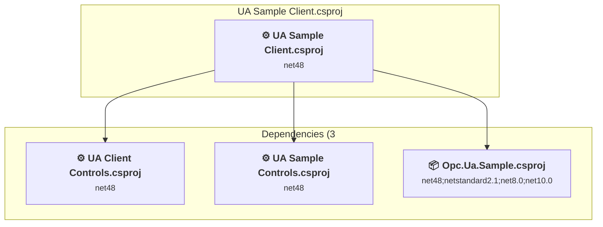

### API Compatibility

| Category | Count | Impact |
| :--- | :---: | :--- |
| 🔴 Binary Incompatible | 17 | High - Require code changes |
| 🟡 Source Incompatible | 2 | Medium - Needs re-compilation and potential conflicting API error fixing |
| 🔵 Behavioral change | 2 | Low - Behavioral changes that may require testing at runtime |
| ✅ Compatible | 279 |  |
| ***Total APIs Analyzed*** | ***300*** |  |

#### Project Technologies and Features

| Technology | Issues | Percentage | Migration Path |
| :--- | :---: | :---: | :--- |
| Legacy Configuration System | 2 | 9,5% | Legacy XML-based configuration system (app.config/web.config) that has been replaced by a more flexible configuration model in .NET Core. The old system was rigid and XML-based. Migrate to Microsoft.Extensions.Configuration with JSON/environment variables; use System.Configuration.ConfigurationManager NuGet package as interim bridge if needed. |
| Windows Forms | 17 | 81,0% | Windows Forms APIs for building Windows desktop applications with traditional Forms-based UI that are available in .NET on Windows. Enable Windows Desktop support: Option 1 (Recommended): Target net9.0-windows; Option 2: Add <UseWindowsDesktop>true</UseWindowsDesktop>; Option 3 (Legacy): Use Microsoft.NET.Sdk.WindowsDesktop SDK. |

<a id="samplesclientcontrolsnet4ua-client-controlscsproj"></a>
### Samples\ClientControls.Net4\UA Client Controls.csproj

#### Project Info

- **Current Target Framework:** net48
- **Proposed Target Framework:** net10.0-windows
- **SDK-style**: False
- **Project Kind:** ClassicWinForms
- **Dependencies**: 0
- **Dependants**: 21
- **Number of Files**: 280
- **Number of Files with Incidents**: 184
- **Lines of Code**: 51162
- **Estimated LOC to modify**: 32412+ (at least 63,4% of the project)

#### Dependency Graph

Legend:
📦 SDK-style project
⚙️ Classic project

```mermaid
flowchart TB
    subgraph upstream["Dependants (21)"]
        P1["<b>⚙️&nbsp;Aggregation Client.csproj</b><br/><small>net48</small>"]
        P4["<b>⚙️&nbsp;AlarmCondition Client.csproj</b><br/><small>net48</small>"]
        P6["<b>⚙️&nbsp;Boiler Client.csproj</b><br/><small>net48</small>"]
        P8["<b>⚙️&nbsp;DataAccess Client.csproj</b><br/><small>net48</small>"]
        P10["<b>⚙️&nbsp;DataTypes Client.csproj</b><br/><small>net48</small>"]
        P13["<b>⚙️&nbsp;Empty Client.csproj</b><br/><small>net48</small>"]
        P15["<b>⚙️&nbsp;GlobalDiscoveryClient.csproj</b><br/><small>net48</small>"]
        P16["<b>⚙️&nbsp;GlobalDiscoveryClientControls.csproj</b><br/><small>net48</small>"]
        P19["<b>⚙️&nbsp;HistoricalAccess Client.csproj</b><br/><small>net48</small>"]
        P21["<b>⚙️&nbsp;Aggregate Tester.csproj</b><br/><small>net48</small>"]
        P22["<b>⚙️&nbsp;HistoricalEvents Client.csproj</b><br/><small>net48</small>"]
        P24["<b>⚙️&nbsp;Methods Client.csproj</b><br/><small>net48</small>"]
        P26["<b>⚙️&nbsp;PerfTest Client.csproj</b><br/><small>net48</small>"]
        P28["<b>⚙️&nbsp;Reference Client.csproj</b><br/><small>net48</small>"]
        P30["<b>⚙️&nbsp;UA Sample Client.csproj</b><br/><small>net48</small>"]
        P32["<b>⚙️&nbsp;UA Sample Controls.csproj</b><br/><small>net48</small>"]
        P34["<b>⚙️&nbsp;UA Sample Server.csproj</b><br/><small>net48</small>"]
        P36["<b>⚙️&nbsp;Quickstart Library.csproj</b><br/><small>net48</small>"]
        P37["<b>⚙️&nbsp;SimpleEvents Client.csproj</b><br/><small>net48</small>"]
        P39["<b>⚙️&nbsp;UserAuthentication Client.csproj</b><br/><small>net48</small>"]
        P41["<b>⚙️&nbsp;Views Client.csproj</b><br/><small>net48</small>"]
        click P1 "#workshopaggregationclientaggregation-clientcsproj"
        click P4 "#workshopalarmconditionclientalarmcondition-clientcsproj"
        click P6 "#workshopboilerclientboiler-clientcsproj"
        click P8 "#workshopdataaccessclientdataaccess-clientcsproj"
        click P10 "#workshopdatatypesclientdatatypes-clientcsproj"
        click P13 "#workshopemptyclientempty-clientcsproj"
        click P15 "#samplesgdsclientglobaldiscoveryclientcsproj"
        click P16 "#samplesgdsclientcontrolsglobaldiscoveryclientcontrolscsproj"
        click P19 "#workshophistoricalaccessclienthistoricalaccess-clientcsproj"
        click P21 "#workshophistoricalaccesstesteraggregate-testercsproj"
        click P22 "#workshophistoricaleventsclienthistoricalevents-clientcsproj"
        click P24 "#workshopmethodsclientmethods-clientcsproj"
        click P26 "#workshopperftestclientperftest-clientcsproj"
        click P28 "#samplesreferenceclientreference-clientcsproj"
        click P30 "#samplesclientnet4ua-sample-clientcsproj"
        click P32 "#samplescontrolsnet4ua-sample-controlscsproj"
        click P34 "#samplesservernet4ua-sample-servercsproj"
        click P36 "#workshopcommonquickstart-librarycsproj"
        click P37 "#workshopsimpleeventsclientsimpleevents-clientcsproj"
        click P39 "#workshopuserauthenticationclientuserauthentication-clientcsproj"
        click P41 "#workshopviewsclientviews-clientcsproj"
    end
    subgraph current["UA Client Controls.csproj"]
        MAIN["<b>⚙️&nbsp;UA Client Controls.csproj</b><br/><small>net48</small>"]
        click MAIN "#samplesclientcontrolsnet4ua-client-controlscsproj"
    end
    P1 --> MAIN
    P4 --> MAIN
    P6 --> MAIN
    P8 --> MAIN
    P10 --> MAIN
    P13 --> MAIN
    P15 --> MAIN
    P16 --> MAIN
    P19 --> MAIN
    P21 --> MAIN
    P22 --> MAIN
    P24 --> MAIN
    P26 --> MAIN
    P28 --> MAIN
    P30 --> MAIN
    P32 --> MAIN
    P34 --> MAIN
    P36 --> MAIN
    P37 --> MAIN
    P39 --> MAIN
    P41 --> MAIN

```

### API Compatibility

| Category | Count | Impact |
| :--- | :---: | :--- |
| 🔴 Binary Incompatible | 31621 | High - Require code changes |
| 🟡 Source Incompatible | 746 | Medium - Needs re-compilation and potential conflicting API error fixing |
| 🔵 Behavioral change | 45 | Low - Behavioral changes that may require testing at runtime |
| ✅ Compatible | 54658 |  |
| ***Total APIs Analyzed*** | ***87070*** |  |

#### Project Technologies and Features

| Technology | Issues | Percentage | Migration Path |
| :--- | :---: | :---: | :--- |
| Legacy Cryptography | 2 | 0,0% | Obsolete or insecure cryptographic algorithms that have been deprecated for security reasons. These algorithms are no longer considered secure by modern standards. Migrate to modern cryptographic APIs using secure algorithms. |
| GDI+ / System.Drawing | 743 | 2,3% | System.Drawing APIs for 2D graphics, imaging, and printing that are available via NuGet package System.Drawing.Common. Note: Not recommended for server scenarios due to Windows dependencies; consider cross-platform alternatives like SkiaSharp or ImageSharp for new code. |
| Windows Forms Legacy Controls | 3283 | 10,1% | Legacy Windows Forms controls that have been removed from .NET Core/5+ including StatusBar, DataGrid, ContextMenu, MainMenu, MenuItem, and ToolBar. These controls were replaced by more modern alternatives. Use ToolStrip, MenuStrip, ContextMenuStrip, and DataGridView instead. |
| Windows Forms | 31621 | 97,6% | Windows Forms APIs for building Windows desktop applications with traditional Forms-based UI that are available in .NET on Windows. Enable Windows Desktop support: Option 1 (Recommended): Target net9.0-windows; Option 2: Add <UseWindowsDesktop>true</UseWindowsDesktop>; Option 3 (Legacy): Use Microsoft.NET.Sdk.WindowsDesktop SDK. |

<a id="samplescontrolsnet4ua-sample-controlscsproj"></a>
### Samples\Controls.Net4\UA Sample Controls.csproj

#### Project Info

- **Current Target Framework:** net48
- **Proposed Target Framework:** net10.0-windows
- **SDK-style**: False
- **Project Kind:** ClassicWinForms
- **Dependencies**: 1
- **Dependants**: 2
- **Number of Files**: 174
- **Number of Files with Incidents**: 115
- **Lines of Code**: 29344
- **Estimated LOC to modify**: 20559+ (at least 70,1% of the project)

#### Dependency Graph

Legend:
📦 SDK-style project
⚙️ Classic project

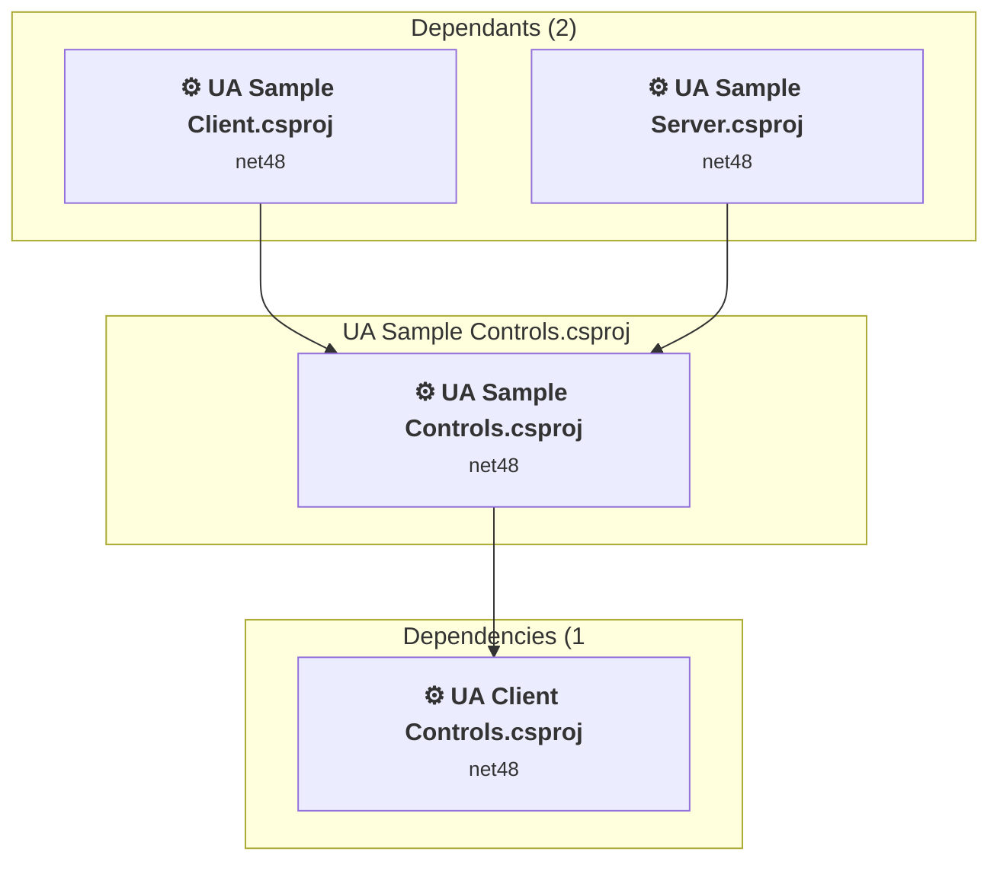

### API Compatibility

| Category | Count | Impact |
| :--- | :---: | :--- |
| 🔴 Binary Incompatible | 20063 | High - Require code changes |
| 🟡 Source Incompatible | 492 | Medium - Needs re-compilation and potential conflicting API error fixing |
| 🔵 Behavioral change | 4 | Low - Behavioral changes that may require testing at runtime |
| ✅ Compatible | 31311 |  |
| ***Total APIs Analyzed*** | ***51870*** |  |

#### Project Technologies and Features

| Technology | Issues | Percentage | Migration Path |
| :--- | :---: | :---: | :--- |
| Windows Forms Legacy Controls | 17 | 0,1% | Legacy Windows Forms controls that have been removed from .NET Core/5+ including StatusBar, DataGrid, ContextMenu, MainMenu, MenuItem, and ToolBar. These controls were replaced by more modern alternatives. Use ToolStrip, MenuStrip, ContextMenuStrip, and DataGridView instead. |
| GDI+ / System.Drawing | 492 | 2,4% | System.Drawing APIs for 2D graphics, imaging, and printing that are available via NuGet package System.Drawing.Common. Note: Not recommended for server scenarios due to Windows dependencies; consider cross-platform alternatives like SkiaSharp or ImageSharp for new code. |
| Windows Forms | 20063 | 97,6% | Windows Forms APIs for building Windows desktop applications with traditional Forms-based UI that are available in .NET on Windows. Enable Windows Desktop support: Option 1 (Recommended): Target net9.0-windows; Option 2: Add <UseWindowsDesktop>true</UseWindowsDesktop>; Option 3 (Legacy): Use Microsoft.NET.Sdk.WindowsDesktop SDK. |

<a id="samplesgdsclientglobaldiscoveryclientcsproj"></a>
### Samples\GDS\Client\GlobalDiscoveryClient.csproj

#### Project Info

- **Current Target Framework:** net48
- **Proposed Target Framework:** net10.0-windows
- **SDK-style**: False
- **Project Kind:** ClassicWinForms
- **Dependencies**: 2
- **Dependants**: 0
- **Number of Files**: 20
- **Number of Files with Incidents**: 13
- **Lines of Code**: 5727
- **Estimated LOC to modify**: 5577+ (at least 97,4% of the project)

#### Dependency Graph

Legend:
📦 SDK-style project
⚙️ Classic project

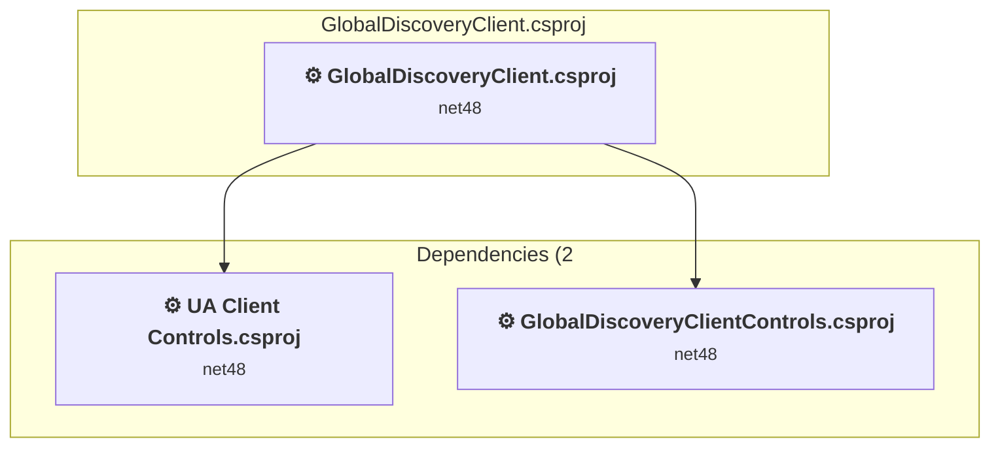

### API Compatibility

| Category | Count | Impact |
| :--- | :---: | :--- |
| 🔴 Binary Incompatible | 5127 | High - Require code changes |
| 🟡 Source Incompatible | 440 | Medium - Needs re-compilation and potential conflicting API error fixing |
| 🔵 Behavioral change | 10 | Low - Behavioral changes that may require testing at runtime |
| ✅ Compatible | 8770 |  |
| ***Total APIs Analyzed*** | ***14347*** |  |

#### Project Technologies and Features

| Technology | Issues | Percentage | Migration Path |
| :--- | :---: | :---: | :--- |
| Legacy Configuration System | 2 | 0,0% | Legacy XML-based configuration system (app.config/web.config) that has been replaced by a more flexible configuration model in .NET Core. The old system was rigid and XML-based. Migrate to Microsoft.Extensions.Configuration with JSON/environment variables; use System.Configuration.ConfigurationManager NuGet package as interim bridge if needed. |
| GDI+ / System.Drawing | 425 | 7,6% | System.Drawing APIs for 2D graphics, imaging, and printing that are available via NuGet package System.Drawing.Common. Note: Not recommended for server scenarios due to Windows dependencies; consider cross-platform alternatives like SkiaSharp or ImageSharp for new code. |
| Windows Forms | 5098 | 91,4% | Windows Forms APIs for building Windows desktop applications with traditional Forms-based UI that are available in .NET on Windows. Enable Windows Desktop support: Option 1 (Recommended): Target net9.0-windows; Option 2: Add <UseWindowsDesktop>true</UseWindowsDesktop>; Option 3 (Legacy): Use Microsoft.NET.Sdk.WindowsDesktop SDK. |

<a id="samplesgdsclientcontrolsglobaldiscoveryclientcontrolscsproj"></a>
### Samples\GDS\ClientControls\GlobalDiscoveryClientControls.csproj

#### Project Info

- **Current Target Framework:** net48
- **Proposed Target Framework:** net10.0-windows
- **SDK-style**: False
- **Project Kind:** ClassicWinForms
- **Dependencies**: 1
- **Dependants**: 1
- **Number of Files**: 56
- **Number of Files with Incidents**: 38
- **Lines of Code**: 9514
- **Estimated LOC to modify**: 8895+ (at least 93,5% of the project)

#### Dependency Graph

Legend:
📦 SDK-style project
⚙️ Classic project

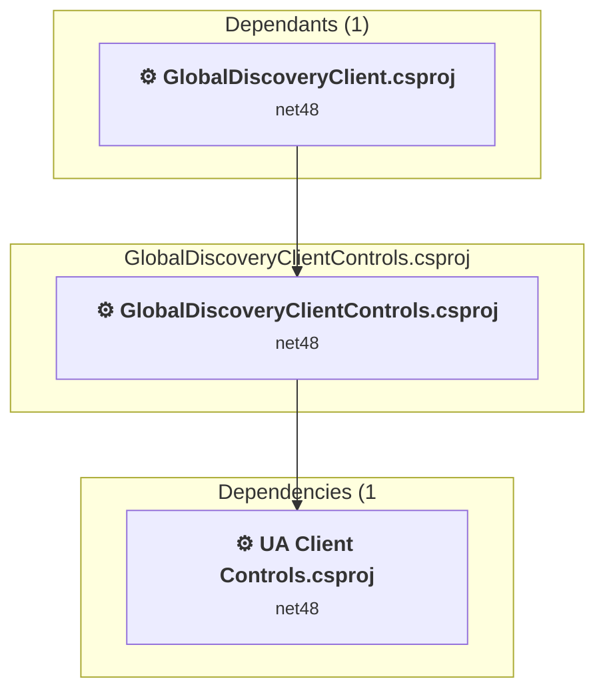

### API Compatibility

| Category | Count | Impact |
| :--- | :---: | :--- |
| 🔴 Binary Incompatible | 8591 | High - Require code changes |
| 🟡 Source Incompatible | 292 | Medium - Needs re-compilation and potential conflicting API error fixing |
| 🔵 Behavioral change | 12 | Low - Behavioral changes that may require testing at runtime |
| ✅ Compatible | 11621 |  |
| ***Total APIs Analyzed*** | ***20516*** |  |

#### Project Technologies and Features

| Technology | Issues | Percentage | Migration Path |
| :--- | :---: | :---: | :--- |
| Windows Forms Legacy Controls | 1164 | 13,1% | Legacy Windows Forms controls that have been removed from .NET Core/5+ including StatusBar, DataGrid, ContextMenu, MainMenu, MenuItem, and ToolBar. These controls were replaced by more modern alternatives. Use ToolStrip, MenuStrip, ContextMenuStrip, and DataGridView instead. |
| GDI+ / System.Drawing | 289 | 3,2% | System.Drawing APIs for 2D graphics, imaging, and printing that are available via NuGet package System.Drawing.Common. Note: Not recommended for server scenarios due to Windows dependencies; consider cross-platform alternatives like SkiaSharp or ImageSharp for new code. |
| Windows Forms | 8591 | 96,6% | Windows Forms APIs for building Windows desktop applications with traditional Forms-based UI that are available in .NET on Windows. Enable Windows Desktop support: Option 1 (Recommended): Target net9.0-windows; Option 2: Add <UseWindowsDesktop>true</UseWindowsDesktop>; Option 3 (Legacy): Use Microsoft.NET.Sdk.WindowsDesktop SDK. |

<a id="samplesgdsconsoleservernetcoreglobaldiscoveryservercsproj"></a>
### Samples\GDS\ConsoleServer\NetCoreGlobalDiscoveryServer.csproj

#### Project Info

- **Current Target Framework:** net10.0✅
- **SDK-style**: True
- **Project Kind:** DotNetCoreApp
- **Dependencies**: 0
- **Dependants**: 0
- **Number of Files**: 2
- **Lines of Code**: 438
- **Estimated LOC to modify**: 0+ (at least 0,0% of the project)

#### Dependency Graph

Legend:
📦 SDK-style project
⚙️ Classic project

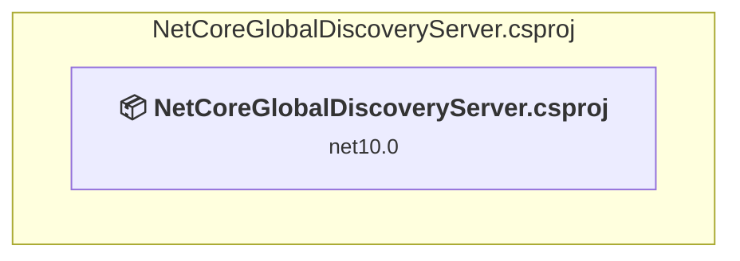

### API Compatibility

| Category | Count | Impact |
| :--- | :---: | :--- |
| 🔴 Binary Incompatible | 0 | High - Require code changes |
| 🟡 Source Incompatible | 0 | Medium - Needs re-compilation and potential conflicting API error fixing |
| 🔵 Behavioral change | 0 | Low - Behavioral changes that may require testing at runtime |
| ✅ Compatible | 0 |  |
| ***Total APIs Analyzed*** | ***0*** |  |

<a id="samplesgdsserverglobaldiscoveryservercsproj"></a>
### Samples\GDS\Server\GlobalDiscoveryServer.csproj

#### Project Info

- **Current Target Framework:** net48
- **Proposed Target Framework:** net10.0-windows
- **SDK-style**: False
- **Project Kind:** ClassicWinForms
- **Dependencies**: 1
- **Dependants**: 0
- **Number of Files**: 30
- **Number of Files with Incidents**: 5
- **Lines of Code**: 1986
- **Estimated LOC to modify**: 12+ (at least 0,6% of the project)

#### Dependency Graph

Legend:
📦 SDK-style project
⚙️ Classic project

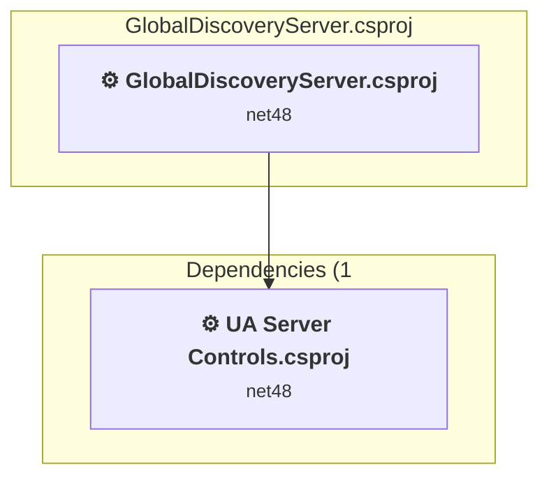

### API Compatibility

| Category | Count | Impact |
| :--- | :---: | :--- |
| 🔴 Binary Incompatible | 6 | High - Require code changes |
| 🟡 Source Incompatible | 4 | Medium - Needs re-compilation and potential conflicting API error fixing |
| 🔵 Behavioral change | 2 | Low - Behavioral changes that may require testing at runtime |
| ✅ Compatible | 2361 |  |
| ***Total APIs Analyzed*** | ***2373*** |  |

#### Project Technologies and Features

| Technology | Issues | Percentage | Migration Path |
| :--- | :---: | :---: | :--- |
| Legacy Configuration System | 2 | 16,7% | Legacy XML-based configuration system (app.config/web.config) that has been replaced by a more flexible configuration model in .NET Core. The old system was rigid and XML-based. Migrate to Microsoft.Extensions.Configuration with JSON/environment variables; use System.Configuration.ConfigurationManager NuGet package as interim bridge if needed. |
| Windows Forms | 6 | 50,0% | Windows Forms APIs for building Windows desktop applications with traditional Forms-based UI that are available in .NET on Windows. Enable Windows Desktop support: Option 1 (Recommended): Target net9.0-windows; Option 2: Add <UseWindowsDesktop>true</UseWindowsDesktop>; Option 3 (Legacy): Use Microsoft.NET.Sdk.WindowsDesktop SDK. |

<a id="samplesopcuasampleopcuasamplecsproj"></a>
### Samples\Opc.Ua.Sample\Opc.Ua.Sample.csproj

#### Project Info

- **Current Target Framework:** net48;netstandard2.1;net8.0;net10.0
- **Proposed Target Framework:** net48;netstandard2.1;net8.0;net10.0;net10.0
- **SDK-style**: True
- **Project Kind:** ClassLibrary
- **Dependencies**: 0
- **Dependants**: 2
- **Number of Files**: 46
- **Number of Files with Incidents**: 2
- **Lines of Code**: 48667
- **Estimated LOC to modify**: 0+ (at least 0,0% of the project)

#### Dependency Graph

Legend:
📦 SDK-style project
⚙️ Classic project

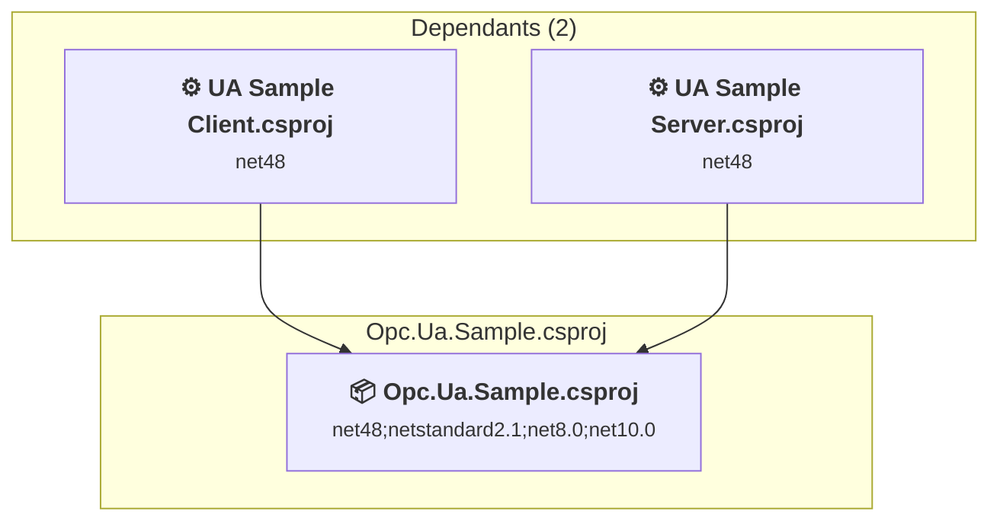

### API Compatibility

| Category | Count | Impact |
| :--- | :---: | :--- |
| 🔴 Binary Incompatible | 0 | High - Require code changes |
| 🟡 Source Incompatible | 0 | Medium - Needs re-compilation and potential conflicting API error fixing |
| 🔵 Behavioral change | 0 | Low - Behavioral changes that may require testing at runtime |
| ✅ Compatible | 23934 |  |
| ***Total APIs Analyzed*** | ***23934*** |  |

<a id="samplesreferenceclientreference-clientcsproj"></a>
### Samples\ReferenceClient\Reference Client.csproj

#### Project Info

- **Current Target Framework:** net48
- **Proposed Target Framework:** net10.0-windows
- **SDK-style**: False
- **Project Kind:** ClassicWinForms
- **Dependencies**: 1
- **Dependants**: 0
- **Number of Files**: 11
- **Number of Files with Incidents**: 6
- **Lines of Code**: 695
- **Estimated LOC to modify**: 260+ (at least 37,4% of the project)

#### Dependency Graph

Legend:
📦 SDK-style project
⚙️ Classic project

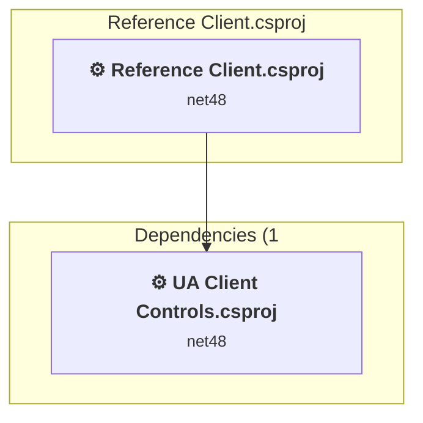

### API Compatibility

| Category | Count | Impact |
| :--- | :---: | :--- |
| 🔴 Binary Incompatible | 256 | High - Require code changes |
| 🟡 Source Incompatible | 2 | Medium - Needs re-compilation and potential conflicting API error fixing |
| 🔵 Behavioral change | 2 | Low - Behavioral changes that may require testing at runtime |
| ✅ Compatible | 681 |  |
| ***Total APIs Analyzed*** | ***941*** |  |

#### Project Technologies and Features

| Technology | Issues | Percentage | Migration Path |
| :--- | :---: | :---: | :--- |
| Legacy Configuration System | 2 | 0,8% | Legacy XML-based configuration system (app.config/web.config) that has been replaced by a more flexible configuration model in .NET Core. The old system was rigid and XML-based. Migrate to Microsoft.Extensions.Configuration with JSON/environment variables; use System.Configuration.ConfigurationManager NuGet package as interim bridge if needed. |
| Windows Forms | 256 | 98,5% | Windows Forms APIs for building Windows desktop applications with traditional Forms-based UI that are available in .NET on Windows. Enable Windows Desktop support: Option 1 (Recommended): Target net9.0-windows; Option 2: Add <UseWindowsDesktop>true</UseWindowsDesktop>; Option 3 (Legacy): Use Microsoft.NET.Sdk.WindowsDesktop SDK. |

<a id="samplesreferenceserverreference-servercsproj"></a>
### Samples\ReferenceServer\Reference Server.csproj

#### Project Info

- **Current Target Framework:** net48
- **Proposed Target Framework:** net10.0-windows
- **SDK-style**: False
- **Project Kind:** ClassicWinForms
- **Dependencies**: 1
- **Dependants**: 0
- **Number of Files**: 13
- **Number of Files with Incidents**: 7
- **Lines of Code**: 1158
- **Estimated LOC to modify**: 306+ (at least 26,4% of the project)

#### Dependency Graph

Legend:
📦 SDK-style project
⚙️ Classic project

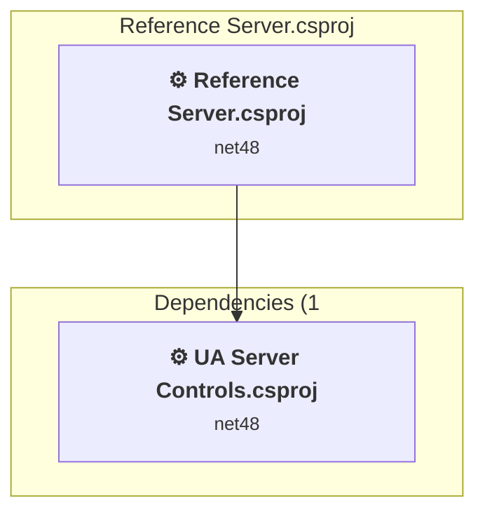

### API Compatibility

| Category | Count | Impact |
| :--- | :---: | :--- |
| 🔴 Binary Incompatible | 300 | High - Require code changes |
| 🟡 Source Incompatible | 4 | Medium - Needs re-compilation and potential conflicting API error fixing |
| 🔵 Behavioral change | 2 | Low - Behavioral changes that may require testing at runtime |
| ✅ Compatible | 1282 |  |
| ***Total APIs Analyzed*** | ***1588*** |  |

#### Project Technologies and Features

| Technology | Issues | Percentage | Migration Path |
| :--- | :---: | :---: | :--- |
| GDI+ / System.Drawing | 2 | 0,7% | System.Drawing APIs for 2D graphics, imaging, and printing that are available via NuGet package System.Drawing.Common. Note: Not recommended for server scenarios due to Windows dependencies; consider cross-platform alternatives like SkiaSharp or ImageSharp for new code. |
| Legacy Configuration System | 2 | 0,7% | Legacy XML-based configuration system (app.config/web.config) that has been replaced by a more flexible configuration model in .NET Core. The old system was rigid and XML-based. Migrate to Microsoft.Extensions.Configuration with JSON/environment variables; use System.Configuration.ConfigurationManager NuGet package as interim bridge if needed. |
| Windows Forms Legacy Controls | 185 | 60,5% | Legacy Windows Forms controls that have been removed from .NET Core/5+ including StatusBar, DataGrid, ContextMenu, MainMenu, MenuItem, and ToolBar. These controls were replaced by more modern alternatives. Use ToolStrip, MenuStrip, ContextMenuStrip, and DataGridView instead. |
| Windows Forms | 300 | 98,0% | Windows Forms APIs for building Windows desktop applications with traditional Forms-based UI that are available in .NET on Windows. Enable Windows Desktop support: Option 1 (Recommended): Target net9.0-windows; Option 2: Add <UseWindowsDesktop>true</UseWindowsDesktop>; Option 3 (Legacy): Use Microsoft.NET.Sdk.WindowsDesktop SDK. |

<a id="samplesservernet4ua-sample-servercsproj"></a>
### Samples\Server.Net4\UA Sample Server.csproj

#### Project Info

- **Current Target Framework:** net48
- **Proposed Target Framework:** net10.0-windows
- **SDK-style**: False
- **Project Kind:** ClassicWinForms
- **Dependencies**: 4
- **Dependants**: 0
- **Number of Files**: 16
- **Number of Files with Incidents**: 8
- **Lines of Code**: 1151
- **Estimated LOC to modify**: 785+ (at least 68,2% of the project)

#### Dependency Graph

Legend:
📦 SDK-style project
⚙️ Classic project

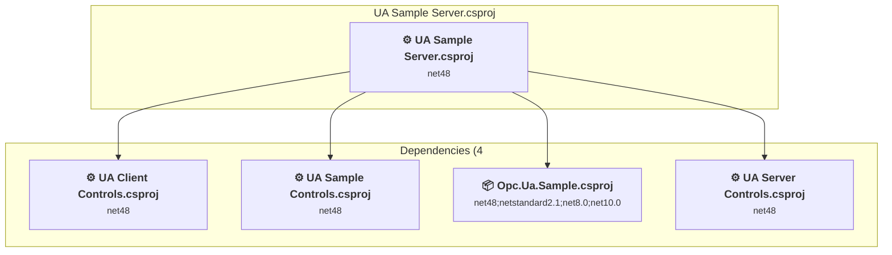

### API Compatibility

| Category | Count | Impact |
| :--- | :---: | :--- |
| 🔴 Binary Incompatible | 770 | High - Require code changes |
| 🟡 Source Incompatible | 13 | Medium - Needs re-compilation and potential conflicting API error fixing |
| 🔵 Behavioral change | 2 | Low - Behavioral changes that may require testing at runtime |
| ✅ Compatible | 1037 |  |
| ***Total APIs Analyzed*** | ***1822*** |  |

#### Project Technologies and Features

| Technology | Issues | Percentage | Migration Path |
| :--- | :---: | :---: | :--- |
| Legacy Configuration System | 2 | 0,3% | Legacy XML-based configuration system (app.config/web.config) that has been replaced by a more flexible configuration model in .NET Core. The old system was rigid and XML-based. Migrate to Microsoft.Extensions.Configuration with JSON/environment variables; use System.Configuration.ConfigurationManager NuGet package as interim bridge if needed. |
| GDI+ / System.Drawing | 11 | 1,4% | System.Drawing APIs for 2D graphics, imaging, and printing that are available via NuGet package System.Drawing.Common. Note: Not recommended for server scenarios due to Windows dependencies; consider cross-platform alternatives like SkiaSharp or ImageSharp for new code. |
| Windows Forms | 770 | 98,1% | Windows Forms APIs for building Windows desktop applications with traditional Forms-based UI that are available in .NET on Windows. Enable Windows Desktop support: Option 1 (Recommended): Target net9.0-windows; Option 2: Add <UseWindowsDesktop>true</UseWindowsDesktop>; Option 3 (Legacy): Use Microsoft.NET.Sdk.WindowsDesktop SDK. |

<a id="samplesservercontrolsnet4ua-server-controlscsproj"></a>
### Samples\ServerControls.Net4\UA Server Controls.csproj

#### Project Info

- **Current Target Framework:** net48
- **Proposed Target Framework:** net10.0-windows
- **SDK-style**: False
- **Project Kind:** ClassicWinForms
- **Dependencies**: 0
- **Dependants**: 17
- **Number of Files**: 21
- **Number of Files with Incidents**: 14
- **Lines of Code**: 1974
- **Estimated LOC to modify**: 1464+ (at least 74,2% of the project)

#### Dependency Graph

Legend:
📦 SDK-style project
⚙️ Classic project

```mermaid
flowchart TB
    subgraph upstream["Dependants (17)"]
        P3["<b>⚙️&nbsp;Aggregation Server.csproj</b><br/><small>net48</small>"]
        P5["<b>⚙️&nbsp;AlarmCondition Server.csproj</b><br/><small>net48</small>"]
        P7["<b>⚙️&nbsp;Boiler Server.csproj</b><br/><small>net48</small>"]
        P9["<b>⚙️&nbsp;DataAccess Server.csproj</b><br/><small>net48</small>"]
        P12["<b>⚙️&nbsp;DataTypes Server.csproj</b><br/><small>net48</small>"]
        P14["<b>⚙️&nbsp;Empty Server.csproj</b><br/><small>net48</small>"]
        P18["<b>⚙️&nbsp;GlobalDiscoveryServer.csproj</b><br/><small>net48</small>"]
        P20["<b>⚙️&nbsp;HistoricalAccess Server.csproj</b><br/><small>net48</small>"]
        P23["<b>⚙️&nbsp;HistoricalEvents Server.csproj</b><br/><small>net48</small>"]
        P25["<b>⚙️&nbsp;Methods Server.csproj</b><br/><small>net48</small>"]
        P27["<b>⚙️&nbsp;PerfTest Server.csproj</b><br/><small>net48</small>"]
        P29["<b>⚙️&nbsp;Reference Server.csproj</b><br/><small>net48</small>"]
        P34["<b>⚙️&nbsp;UA Sample Server.csproj</b><br/><small>net48</small>"]
        P36["<b>⚙️&nbsp;Quickstart Library.csproj</b><br/><small>net48</small>"]
        P38["<b>⚙️&nbsp;SimpleEvents Server.csproj</b><br/><small>net48</small>"]
        P40["<b>⚙️&nbsp;UserAuthentication Server.csproj</b><br/><small>net48</small>"]
        P42["<b>⚙️&nbsp;Views Server.csproj</b><br/><small>net48</small>"]
        click P3 "#workshopaggregationserveraggregation-servercsproj"
        click P5 "#workshopalarmconditionserveralarmcondition-servercsproj"
        click P7 "#workshopboilerserverboiler-servercsproj"
        click P9 "#workshopdataaccessserverdataaccess-servercsproj"
        click P12 "#workshopdatatypesserverdatatypes-servercsproj"
        click P14 "#workshopemptyserverempty-servercsproj"
        click P18 "#samplesgdsserverglobaldiscoveryservercsproj"
        click P20 "#workshophistoricalaccessserverhistoricalaccess-servercsproj"
        click P23 "#workshophistoricaleventsserverhistoricalevents-servercsproj"
        click P25 "#workshopmethodsservermethods-servercsproj"
        click P27 "#workshopperftestserverperftest-servercsproj"
        click P29 "#samplesreferenceserverreference-servercsproj"
        click P34 "#samplesservernet4ua-sample-servercsproj"
        click P36 "#workshopcommonquickstart-librarycsproj"
        click P38 "#workshopsimpleeventsserversimpleevents-servercsproj"
        click P40 "#workshopuserauthenticationserveruserauthentication-servercsproj"
        click P42 "#workshopviewsserverviews-servercsproj"
    end
    subgraph current["UA Server Controls.csproj"]
        MAIN["<b>⚙️&nbsp;UA Server Controls.csproj</b><br/><small>net48</small>"]
        click MAIN "#samplesservercontrolsnet4ua-server-controlscsproj"
    end
    P3 --> MAIN
    P5 --> MAIN
    P7 --> MAIN
    P9 --> MAIN
    P12 --> MAIN
    P14 --> MAIN
    P18 --> MAIN
    P20 --> MAIN
    P23 --> MAIN
    P25 --> MAIN
    P27 --> MAIN
    P29 --> MAIN
    P34 --> MAIN
    P36 --> MAIN
    P38 --> MAIN
    P40 --> MAIN
    P42 --> MAIN

```

### API Compatibility

| Category | Count | Impact |
| :--- | :---: | :--- |
| 🔴 Binary Incompatible | 1379 | High - Require code changes |
| 🟡 Source Incompatible | 85 | Medium - Needs re-compilation and potential conflicting API error fixing |
| 🔵 Behavioral change | 0 | Low - Behavioral changes that may require testing at runtime |
| ✅ Compatible | 1950 |  |
| ***Total APIs Analyzed*** | ***3414*** |  |

#### Project Technologies and Features

| Technology | Issues | Percentage | Migration Path |
| :--- | :---: | :---: | :--- |
| GDI+ / System.Drawing | 85 | 5,8% | System.Drawing APIs for 2D graphics, imaging, and printing that are available via NuGet package System.Drawing.Common. Note: Not recommended for server scenarios due to Windows dependencies; consider cross-platform alternatives like SkiaSharp or ImageSharp for new code. |
| Windows Forms | 1379 | 94,2% | Windows Forms APIs for building Windows desktop applications with traditional Forms-based UI that are available in .NET on Windows. Enable Windows Desktop support: Option 1 (Recommended): Target net9.0-windows; Option 2: Add <UseWindowsDesktop>true</UseWindowsDesktop>; Option 3 (Legacy): Use Microsoft.NET.Sdk.WindowsDesktop SDK. |

<a id="workshopaggregationclientaggregation-clientcsproj"></a>
### Workshop\Aggregation\Client\Aggregation Client.csproj

#### Project Info

- **Current Target Framework:** net48
- **Proposed Target Framework:** net10.0-windows
- **SDK-style**: False
- **Project Kind:** ClassicWinForms
- **Dependencies**: 1
- **Dependants**: 0
- **Number of Files**: 20
- **Number of Files with Incidents**: 12
- **Lines of Code**: 1929
- **Estimated LOC to modify**: 1230+ (at least 63,8% of the project)

#### Dependency Graph

Legend:
📦 SDK-style project
⚙️ Classic project

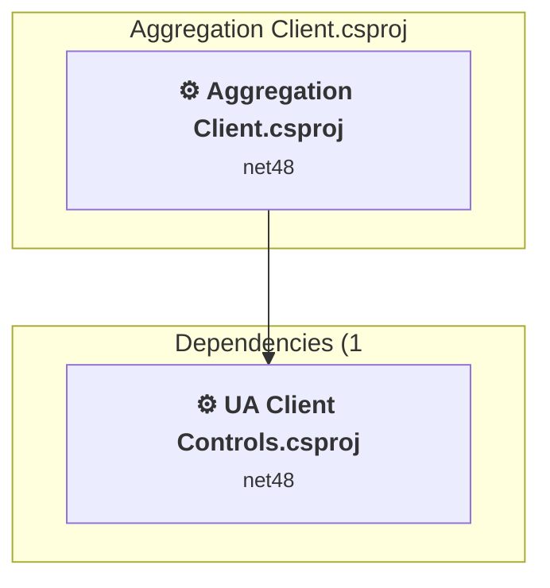

### API Compatibility

| Category | Count | Impact |
| :--- | :---: | :--- |
| 🔴 Binary Incompatible | 1206 | High - Require code changes |
| 🟡 Source Incompatible | 22 | Medium - Needs re-compilation and potential conflicting API error fixing |
| 🔵 Behavioral change | 2 | Low - Behavioral changes that may require testing at runtime |
| ✅ Compatible | 1911 |  |
| ***Total APIs Analyzed*** | ***3141*** |  |

#### Project Technologies and Features

| Technology | Issues | Percentage | Migration Path |
| :--- | :---: | :---: | :--- |
| Legacy Configuration System | 2 | 0,2% | Legacy XML-based configuration system (app.config/web.config) that has been replaced by a more flexible configuration model in .NET Core. The old system was rigid and XML-based. Migrate to Microsoft.Extensions.Configuration with JSON/environment variables; use System.Configuration.ConfigurationManager NuGet package as interim bridge if needed. |
| Windows Forms Legacy Controls | 46 | 3,7% | Legacy Windows Forms controls that have been removed from .NET Core/5+ including StatusBar, DataGrid, ContextMenu, MainMenu, MenuItem, and ToolBar. These controls were replaced by more modern alternatives. Use ToolStrip, MenuStrip, ContextMenuStrip, and DataGridView instead. |
| GDI+ / System.Drawing | 20 | 1,6% | System.Drawing APIs for 2D graphics, imaging, and printing that are available via NuGet package System.Drawing.Common. Note: Not recommended for server scenarios due to Windows dependencies; consider cross-platform alternatives like SkiaSharp or ImageSharp for new code. |
| Windows Forms | 1206 | 98,0% | Windows Forms APIs for building Windows desktop applications with traditional Forms-based UI that are available in .NET on Windows. Enable Windows Desktop support: Option 1 (Recommended): Target net9.0-windows; Option 2: Add <UseWindowsDesktop>true</UseWindowsDesktop>; Option 3 (Legacy): Use Microsoft.NET.Sdk.WindowsDesktop SDK. |

<a id="workshopaggregationconsoleaggregationserverconsoleaggregationservercsproj"></a>
### Workshop\Aggregation\ConsoleAggregationServer\ConsoleAggregationServer.csproj

#### Project Info

- **Current Target Framework:** net8.0
- **Proposed Target Framework:** net10.0
- **SDK-style**: True
- **Project Kind:** DotNetCoreApp
- **Dependencies**: 0
- **Dependants**: 0
- **Number of Files**: 13
- **Number of Files with Incidents**: 5
- **Lines of Code**: 3846
- **Estimated LOC to modify**: 10+ (at least 0,3% of the project)

#### Dependency Graph

Legend:
📦 SDK-style project
⚙️ Classic project

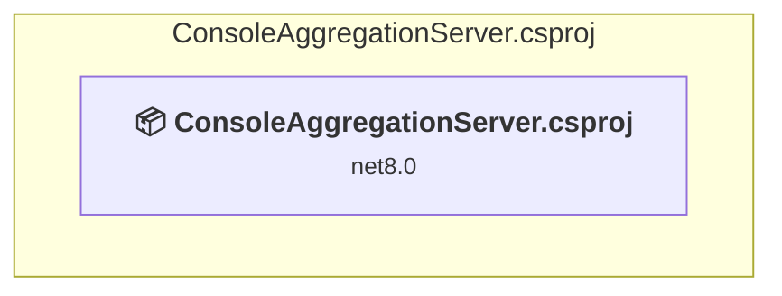

### API Compatibility

| Category | Count | Impact |
| :--- | :---: | :--- |
| 🔴 Binary Incompatible | 0 | High - Require code changes |
| 🟡 Source Incompatible | 1 | Medium - Needs re-compilation and potential conflicting API error fixing |
| 🔵 Behavioral change | 9 | Low - Behavioral changes that may require testing at runtime |
| ✅ Compatible | 3527 |  |
| ***Total APIs Analyzed*** | ***3537*** |  |

<a id="workshopaggregationserveraggregation-servercsproj"></a>
### Workshop\Aggregation\Server\Aggregation Server.csproj

#### Project Info

- **Current Target Framework:** net48
- **Proposed Target Framework:** net10.0-windows
- **SDK-style**: False
- **Project Kind:** ClassicWinForms
- **Dependencies**: 1
- **Dependants**: 0
- **Number of Files**: 21
- **Number of Files with Incidents**: 6
- **Lines of Code**: 3761
- **Estimated LOC to modify**: 16+ (at least 0,4% of the project)

#### Dependency Graph

Legend:
📦 SDK-style project
⚙️ Classic project

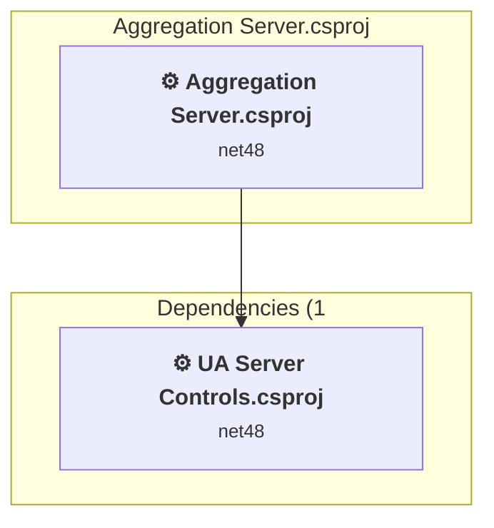

### API Compatibility

| Category | Count | Impact |
| :--- | :---: | :--- |
| 🔴 Binary Incompatible | 6 | High - Require code changes |
| 🟡 Source Incompatible | 2 | Medium - Needs re-compilation and potential conflicting API error fixing |
| 🔵 Behavioral change | 8 | Low - Behavioral changes that may require testing at runtime |
| ✅ Compatible | 3964 |  |
| ***Total APIs Analyzed*** | ***3980*** |  |

#### Project Technologies and Features

| Technology | Issues | Percentage | Migration Path |
| :--- | :---: | :---: | :--- |
| Legacy Configuration System | 2 | 12,5% | Legacy XML-based configuration system (app.config/web.config) that has been replaced by a more flexible configuration model in .NET Core. The old system was rigid and XML-based. Migrate to Microsoft.Extensions.Configuration with JSON/environment variables; use System.Configuration.ConfigurationManager NuGet package as interim bridge if needed. |
| Windows Forms | 6 | 37,5% | Windows Forms APIs for building Windows desktop applications with traditional Forms-based UI that are available in .NET on Windows. Enable Windows Desktop support: Option 1 (Recommended): Target net9.0-windows; Option 2: Add <UseWindowsDesktop>true</UseWindowsDesktop>; Option 3 (Legacy): Use Microsoft.NET.Sdk.WindowsDesktop SDK. |

<a id="workshopalarmconditionclientalarmcondition-clientcsproj"></a>
### Workshop\AlarmCondition\Client\AlarmCondition Client.csproj

#### Project Info

- **Current Target Framework:** net48
- **Proposed Target Framework:** net10.0-windows
- **SDK-style**: False
- **Project Kind:** ClassicWinForms
- **Dependencies**: 2
- **Dependants**: 0
- **Number of Files**: 28
- **Number of Files with Incidents**: 17
- **Lines of Code**: 4679
- **Estimated LOC to modify**: 2581+ (at least 55,2% of the project)

#### Dependency Graph

Legend:
📦 SDK-style project
⚙️ Classic project

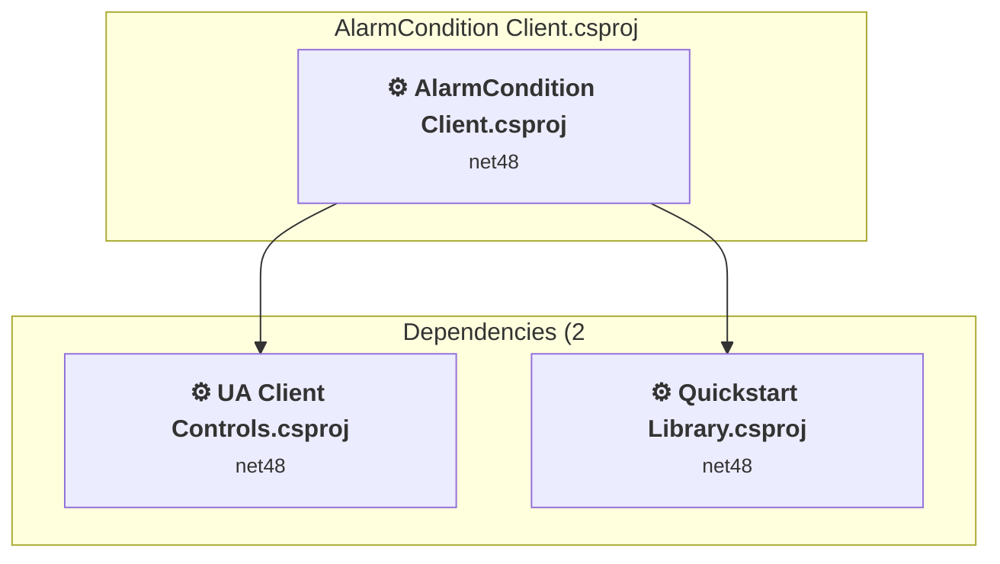

### API Compatibility

| Category | Count | Impact |
| :--- | :---: | :--- |
| 🔴 Binary Incompatible | 2566 | High - Require code changes |
| 🟡 Source Incompatible | 10 | Medium - Needs re-compilation and potential conflicting API error fixing |
| 🔵 Behavioral change | 5 | Low - Behavioral changes that may require testing at runtime |
| ✅ Compatible | 4537 |  |
| ***Total APIs Analyzed*** | ***7118*** |  |

#### Project Technologies and Features

| Technology | Issues | Percentage | Migration Path |
| :--- | :---: | :---: | :--- |
| Legacy Configuration System | 2 | 0,1% | Legacy XML-based configuration system (app.config/web.config) that has been replaced by a more flexible configuration model in .NET Core. The old system was rigid and XML-based. Migrate to Microsoft.Extensions.Configuration with JSON/environment variables; use System.Configuration.ConfigurationManager NuGet package as interim bridge if needed. |
| GDI+ / System.Drawing | 8 | 0,3% | System.Drawing APIs for 2D graphics, imaging, and printing that are available via NuGet package System.Drawing.Common. Note: Not recommended for server scenarios due to Windows dependencies; consider cross-platform alternatives like SkiaSharp or ImageSharp for new code. |
| Windows Forms | 2566 | 99,4% | Windows Forms APIs for building Windows desktop applications with traditional Forms-based UI that are available in .NET on Windows. Enable Windows Desktop support: Option 1 (Recommended): Target net9.0-windows; Option 2: Add <UseWindowsDesktop>true</UseWindowsDesktop>; Option 3 (Legacy): Use Microsoft.NET.Sdk.WindowsDesktop SDK. |

<a id="workshopalarmconditionserveralarmcondition-servercsproj"></a>
### Workshop\AlarmCondition\Server\AlarmCondition Server.csproj

#### Project Info

- **Current Target Framework:** net48
- **Proposed Target Framework:** net10.0-windows
- **SDK-style**: False
- **Project Kind:** ClassicWinForms
- **Dependencies**: 2
- **Dependants**: 0
- **Number of Files**: 19
- **Number of Files with Incidents**: 4
- **Lines of Code**: 3156
- **Estimated LOC to modify**: 10+ (at least 0,3% of the project)

#### Dependency Graph

Legend:
📦 SDK-style project
⚙️ Classic project


### API Compatibility

| Category | Count | Impact |
| :--- | :---: | :--- |
| 🔴 Binary Incompatible | 6 | High - Require code changes |
| 🟡 Source Incompatible | 2 | Medium - Needs re-compilation and potential conflicting API error fixing |
| 🔵 Behavioral change | 2 | Low - Behavioral changes that may require testing at runtime |
| ✅ Compatible | 2978 |  |
| ***Total APIs Analyzed*** | ***2988*** |  |

#### Project Technologies and Features

| Technology | Issues | Percentage | Migration Path |
| :--- | :---: | :---: | :--- |
| Legacy Configuration System | 2 | 20,0% | Legacy XML-based configuration system (app.config/web.config) that has been replaced by a more flexible configuration model in .NET Core. The old system was rigid and XML-based. Migrate to Microsoft.Extensions.Configuration with JSON/environment variables; use System.Configuration.ConfigurationManager NuGet package as interim bridge if needed. |
| Windows Forms | 6 | 60,0% | Windows Forms APIs for building Windows desktop applications with traditional Forms-based UI that are available in .NET on Windows. Enable Windows Desktop support: Option 1 (Recommended): Target net9.0-windows; Option 2: Add <UseWindowsDesktop>true</UseWindowsDesktop>; Option 3 (Legacy): Use Microsoft.NET.Sdk.WindowsDesktop SDK. |

<a id="workshopboilerclientboiler-clientcsproj"></a>
### Workshop\Boiler\Client\Boiler Client.csproj

#### Project Info

- **Current Target Framework:** net48
- **Proposed Target Framework:** net10.0-windows
- **SDK-style**: False
- **Project Kind:** ClassicWinForms
- **Dependencies**: 1
- **Dependants**: 0
- **Number of Files**: 13
- **Number of Files with Incidents**: 6
- **Lines of Code**: 2684
- **Estimated LOC to modify**: 466+ (at least 17,4% of the project)

#### Dependency Graph

Legend:
📦 SDK-style project
⚙️ Classic project

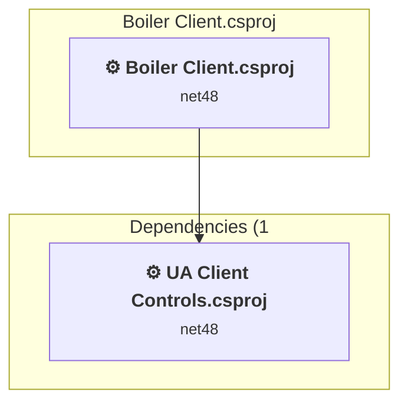

### API Compatibility

| Category | Count | Impact |
| :--- | :---: | :--- |
| 🔴 Binary Incompatible | 454 | High - Require code changes |
| 🟡 Source Incompatible | 10 | Medium - Needs re-compilation and potential conflicting API error fixing |
| 🔵 Behavioral change | 2 | Low - Behavioral changes that may require testing at runtime |
| ✅ Compatible | 1475 |  |
| ***Total APIs Analyzed*** | ***1941*** |  |

#### Project Technologies and Features

| Technology | Issues | Percentage | Migration Path |
| :--- | :---: | :---: | :--- |
| Legacy Configuration System | 2 | 0,4% | Legacy XML-based configuration system (app.config/web.config) that has been replaced by a more flexible configuration model in .NET Core. The old system was rigid and XML-based. Migrate to Microsoft.Extensions.Configuration with JSON/environment variables; use System.Configuration.ConfigurationManager NuGet package as interim bridge if needed. |
| GDI+ / System.Drawing | 8 | 1,7% | System.Drawing APIs for 2D graphics, imaging, and printing that are available via NuGet package System.Drawing.Common. Note: Not recommended for server scenarios due to Windows dependencies; consider cross-platform alternatives like SkiaSharp or ImageSharp for new code. |
| Windows Forms | 454 | 97,4% | Windows Forms APIs for building Windows desktop applications with traditional Forms-based UI that are available in .NET on Windows. Enable Windows Desktop support: Option 1 (Recommended): Target net9.0-windows; Option 2: Add <UseWindowsDesktop>true</UseWindowsDesktop>; Option 3 (Legacy): Use Microsoft.NET.Sdk.WindowsDesktop SDK. |

<a id="workshopboilerserverboiler-servercsproj"></a>
### Workshop\Boiler\Server\Boiler Server.csproj

#### Project Info

- **Current Target Framework:** net48
- **Proposed Target Framework:** net10.0-windows
- **SDK-style**: False
- **Project Kind:** ClassicWinForms
- **Dependencies**: 1
- **Dependants**: 0
- **Number of Files**: 18
- **Number of Files with Incidents**: 4
- **Lines of Code**: 4671
- **Estimated LOC to modify**: 10+ (at least 0,2% of the project)

#### Dependency Graph

Legend:
📦 SDK-style project
⚙️ Classic project

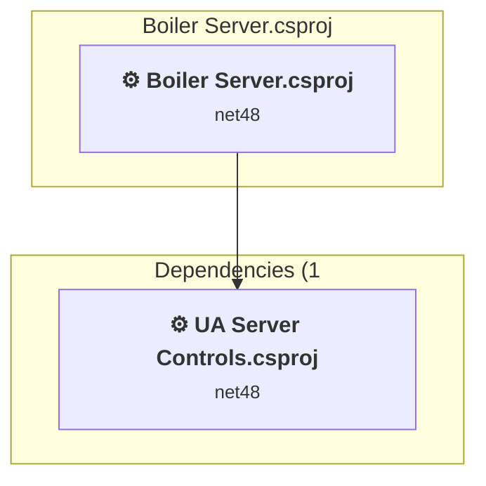

### API Compatibility

| Category | Count | Impact |
| :--- | :---: | :--- |
| 🔴 Binary Incompatible | 6 | High - Require code changes |
| 🟡 Source Incompatible | 2 | Medium - Needs re-compilation and potential conflicting API error fixing |
| 🔵 Behavioral change | 2 | Low - Behavioral changes that may require testing at runtime |
| ✅ Compatible | 2578 |  |
| ***Total APIs Analyzed*** | ***2588*** |  |

#### Project Technologies and Features

| Technology | Issues | Percentage | Migration Path |
| :--- | :---: | :---: | :--- |
| Legacy Configuration System | 2 | 20,0% | Legacy XML-based configuration system (app.config/web.config) that has been replaced by a more flexible configuration model in .NET Core. The old system was rigid and XML-based. Migrate to Microsoft.Extensions.Configuration with JSON/environment variables; use System.Configuration.ConfigurationManager NuGet package as interim bridge if needed. |
| Windows Forms | 6 | 60,0% | Windows Forms APIs for building Windows desktop applications with traditional Forms-based UI that are available in .NET on Windows. Enable Windows Desktop support: Option 1 (Recommended): Target net9.0-windows; Option 2: Add <UseWindowsDesktop>true</UseWindowsDesktop>; Option 3 (Legacy): Use Microsoft.NET.Sdk.WindowsDesktop SDK. |

<a id="workshopcommonquickstart-librarycsproj"></a>
### Workshop\Common\Quickstart Library.csproj

#### Project Info

- **Current Target Framework:** net48
- **Proposed Target Framework:** net10.0-windows
- **SDK-style**: False
- **Project Kind:** ClassicWinForms
- **Dependencies**: 2
- **Dependants**: 6
- **Number of Files**: 13
- **Number of Files with Incidents**: 5
- **Lines of Code**: 7504
- **Estimated LOC to modify**: 212+ (at least 2,8% of the project)

#### Dependency Graph

Legend:
📦 SDK-style project
⚙️ Classic project

```mermaid
flowchart TB
    subgraph upstream["Dependants (6)"]
        P4["<b>⚙️&nbsp;AlarmCondition Client.csproj</b><br/><small>net48</small>"]
        P5["<b>⚙️&nbsp;AlarmCondition Server.csproj</b><br/><small>net48</small>"]
        P8["<b>⚙️&nbsp;DataAccess Client.csproj</b><br/><small>net48</small>"]
        P9["<b>⚙️&nbsp;DataAccess Server.csproj</b><br/><small>net48</small>"]
        P22["<b>⚙️&nbsp;HistoricalEvents Client.csproj</b><br/><small>net48</small>"]
        P23["<b>⚙️&nbsp;HistoricalEvents Server.csproj</b><br/><small>net48</small>"]
        click P4 "#workshopalarmconditionclientalarmcondition-clientcsproj"
        click P5 "#workshopalarmconditionserveralarmcondition-servercsproj"
        click P8 "#workshopdataaccessclientdataaccess-clientcsproj"
        click P9 "#workshopdataaccessserverdataaccess-servercsproj"
        click P22 "#workshophistoricaleventsclienthistoricalevents-clientcsproj"
        click P23 "#workshophistoricaleventsserverhistoricalevents-servercsproj"
    end
    subgraph current["Quickstart Library.csproj"]
        MAIN["<b>⚙️&nbsp;Quickstart Library.csproj</b><br/><small>net48</small>"]
        click MAIN "#workshopcommonquickstart-librarycsproj"
    end
    subgraph downstream["Dependencies (2"]
        P31["<b>⚙️&nbsp;UA Client Controls.csproj</b><br/><small>net48</small>"]
        P35["<b>⚙️&nbsp;UA Server Controls.csproj</b><br/><small>net48</small>"]
        click P31 "#samplesclientcontrolsnet4ua-client-controlscsproj"
        click P35 "#samplesservercontrolsnet4ua-server-controlscsproj"
    end
    P4 --> MAIN
    P5 --> MAIN
    P8 --> MAIN
    P9 --> MAIN
    P22 --> MAIN
    P23 --> MAIN
    MAIN --> P31
    MAIN --> P35

```

### API Compatibility

| Category | Count | Impact |
| :--- | :---: | :--- |
| 🔴 Binary Incompatible | 207 | High - Require code changes |
| 🟡 Source Incompatible | 0 | Medium - Needs re-compilation and potential conflicting API error fixing |
| 🔵 Behavioral change | 5 | Low - Behavioral changes that may require testing at runtime |
| ✅ Compatible | 6632 |  |
| ***Total APIs Analyzed*** | ***6844*** |  |

#### Project Technologies and Features

| Technology | Issues | Percentage | Migration Path |
| :--- | :---: | :---: | :--- |
| Windows Forms | 207 | 97,6% | Windows Forms APIs for building Windows desktop applications with traditional Forms-based UI that are available in .NET on Windows. Enable Windows Desktop support: Option 1 (Recommended): Target net9.0-windows; Option 2: Add <UseWindowsDesktop>true</UseWindowsDesktop>; Option 3 (Legacy): Use Microsoft.NET.Sdk.WindowsDesktop SDK. |

<a id="workshopdataaccessclientdataaccess-clientcsproj"></a>
### Workshop\DataAccess\Client\DataAccess Client.csproj

#### Project Info

- **Current Target Framework:** net48
- **Proposed Target Framework:** net10.0-windows
- **SDK-style**: False
- **Project Kind:** ClassicWinForms
- **Dependencies**: 2
- **Dependants**: 0
- **Number of Files**: 17
- **Number of Files with Incidents**: 10
- **Lines of Code**: 3575
- **Estimated LOC to modify**: 2609+ (at least 73,0% of the project)

#### Dependency Graph

Legend:
📦 SDK-style project
⚙️ Classic project

```mermaid
flowchart TB
    subgraph current["DataAccess Client.csproj"]
        MAIN["<b>⚙️&nbsp;DataAccess Client.csproj</b><br/><small>net48</small>"]
        click MAIN "#workshopdataaccessclientdataaccess-clientcsproj"
    end
    subgraph downstream["Dependencies (2"]
        P31["<b>⚙️&nbsp;UA Client Controls.csproj</b><br/><small>net48</small>"]
        P36["<b>⚙️&nbsp;Quickstart Library.csproj</b><br/><small>net48</small>"]
        click P31 "#samplesclientcontrolsnet4ua-client-controlscsproj"
        click P36 "#workshopcommonquickstart-librarycsproj"
    end
    MAIN --> P31
    MAIN --> P36

```

### API Compatibility

| Category | Count | Impact |
| :--- | :---: | :--- |
| 🔴 Binary Incompatible | 2597 | High - Require code changes |
| 🟡 Source Incompatible | 10 | Medium - Needs re-compilation and potential conflicting API error fixing |
| 🔵 Behavioral change | 2 | Low - Behavioral changes that may require testing at runtime |
| ✅ Compatible | 4286 |  |
| ***Total APIs Analyzed*** | ***6895*** |  |

#### Project Technologies and Features

| Technology | Issues | Percentage | Migration Path |
| :--- | :---: | :---: | :--- |
| Legacy Configuration System | 2 | 0,1% | Legacy XML-based configuration system (app.config/web.config) that has been replaced by a more flexible configuration model in .NET Core. The old system was rigid and XML-based. Migrate to Microsoft.Extensions.Configuration with JSON/environment variables; use System.Configuration.ConfigurationManager NuGet package as interim bridge if needed. |
| Windows Forms Legacy Controls | 2 | 0,1% | Legacy Windows Forms controls that have been removed from .NET Core/5+ including StatusBar, DataGrid, ContextMenu, MainMenu, MenuItem, and ToolBar. These controls were replaced by more modern alternatives. Use ToolStrip, MenuStrip, ContextMenuStrip, and DataGridView instead. |
| GDI+ / System.Drawing | 8 | 0,3% | System.Drawing APIs for 2D graphics, imaging, and printing that are available via NuGet package System.Drawing.Common. Note: Not recommended for server scenarios due to Windows dependencies; consider cross-platform alternatives like SkiaSharp or ImageSharp for new code. |
| Windows Forms | 2597 | 99,5% | Windows Forms APIs for building Windows desktop applications with traditional Forms-based UI that are available in .NET on Windows. Enable Windows Desktop support: Option 1 (Recommended): Target net9.0-windows; Option 2: Add <UseWindowsDesktop>true</UseWindowsDesktop>; Option 3 (Legacy): Use Microsoft.NET.Sdk.WindowsDesktop SDK. |

<a id="workshopdataaccessserverdataaccess-servercsproj"></a>
### Workshop\DataAccess\Server\DataAccess Server.csproj

#### Project Info

- **Current Target Framework:** net48
- **Proposed Target Framework:** net10.0-windows
- **SDK-style**: False
- **Project Kind:** ClassicWinForms
- **Dependencies**: 2
- **Dependants**: 0
- **Number of Files**: 23
- **Number of Files with Incidents**: 4
- **Lines of Code**: 3549
- **Estimated LOC to modify**: 10+ (at least 0,3% of the project)

#### Dependency Graph

Legend:
📦 SDK-style project
⚙️ Classic project

```mermaid
flowchart TB
    subgraph current["DataAccess Server.csproj"]
        MAIN["<b>⚙️&nbsp;DataAccess Server.csproj</b><br/><small>net48</small>"]
        click MAIN "#workshopdataaccessserverdataaccess-servercsproj"
    end
    subgraph downstream["Dependencies (2"]
        P35["<b>⚙️&nbsp;UA Server Controls.csproj</b><br/><small>net48</small>"]
        P36["<b>⚙️&nbsp;Quickstart Library.csproj</b><br/><small>net48</small>"]
        click P35 "#samplesservercontrolsnet4ua-server-controlscsproj"
        click P36 "#workshopcommonquickstart-librarycsproj"
    end
    MAIN --> P35
    MAIN --> P36

```

### API Compatibility

| Category | Count | Impact |
| :--- | :---: | :--- |
| 🔴 Binary Incompatible | 6 | High - Require code changes |
| 🟡 Source Incompatible | 2 | Medium - Needs re-compilation and potential conflicting API error fixing |
| 🔵 Behavioral change | 2 | Low - Behavioral changes that may require testing at runtime |
| ✅ Compatible | 2749 |  |
| ***Total APIs Analyzed*** | ***2759*** |  |

#### Project Technologies and Features

| Technology | Issues | Percentage | Migration Path |
| :--- | :---: | :---: | :--- |
| Legacy Configuration System | 2 | 20,0% | Legacy XML-based configuration system (app.config/web.config) that has been replaced by a more flexible configuration model in .NET Core. The old system was rigid and XML-based. Migrate to Microsoft.Extensions.Configuration with JSON/environment variables; use System.Configuration.ConfigurationManager NuGet package as interim bridge if needed. |
| Windows Forms | 6 | 60,0% | Windows Forms APIs for building Windows desktop applications with traditional Forms-based UI that are available in .NET on Windows. Enable Windows Desktop support: Option 1 (Recommended): Target net9.0-windows; Option 2: Add <UseWindowsDesktop>true</UseWindowsDesktop>; Option 3 (Legacy): Use Microsoft.NET.Sdk.WindowsDesktop SDK. |

<a id="workshopdatatypesclientdatatypes-clientcsproj"></a>
### Workshop\DataTypes\Client\DataTypes Client.csproj

#### Project Info

- **Current Target Framework:** net48
- **Proposed Target Framework:** net10.0-windows
- **SDK-style**: False
- **Project Kind:** ClassicWinForms
- **Dependencies**: 2
- **Dependants**: 0
- **Number of Files**: 11
- **Number of Files with Incidents**: 6
- **Lines of Code**: 731
- **Estimated LOC to modify**: 306+ (at least 41,9% of the project)

#### Dependency Graph

Legend:
📦 SDK-style project
⚙️ Classic project

```mermaid
flowchart TB
    subgraph current["DataTypes Client.csproj"]
        MAIN["<b>⚙️&nbsp;DataTypes Client.csproj</b><br/><small>net48</small>"]
        click MAIN "#workshopdatatypesclientdatatypes-clientcsproj"
    end
    subgraph downstream["Dependencies (2"]
        P31["<b>⚙️&nbsp;UA Client Controls.csproj</b><br/><small>net48</small>"]
        P11["<b>⚙️&nbsp;DataTypes Library.csproj</b><br/><small>net48</small>"]
        click P31 "#samplesclientcontrolsnet4ua-client-controlscsproj"
        click P11 "#workshopdatatypescommondatatypes-librarycsproj"
    end
    MAIN --> P31
    MAIN --> P11

```

### API Compatibility

| Category | Count | Impact |
| :--- | :---: | :--- |
| 🔴 Binary Incompatible | 294 | High - Require code changes |
| 🟡 Source Incompatible | 10 | Medium - Needs re-compilation and potential conflicting API error fixing |
| 🔵 Behavioral change | 2 | Low - Behavioral changes that may require testing at runtime |
| ✅ Compatible | 740 |  |
| ***Total APIs Analyzed*** | ***1046*** |  |

#### Project Technologies and Features

| Technology | Issues | Percentage | Migration Path |
| :--- | :---: | :---: | :--- |
| Legacy Configuration System | 2 | 0,7% | Legacy XML-based configuration system (app.config/web.config) that has been replaced by a more flexible configuration model in .NET Core. The old system was rigid and XML-based. Migrate to Microsoft.Extensions.Configuration with JSON/environment variables; use System.Configuration.ConfigurationManager NuGet package as interim bridge if needed. |
| Windows Forms Legacy Controls | 1 | 0,3% | Legacy Windows Forms controls that have been removed from .NET Core/5+ including StatusBar, DataGrid, ContextMenu, MainMenu, MenuItem, and ToolBar. These controls were replaced by more modern alternatives. Use ToolStrip, MenuStrip, ContextMenuStrip, and DataGridView instead. |
| GDI+ / System.Drawing | 8 | 2,6% | System.Drawing APIs for 2D graphics, imaging, and printing that are available via NuGet package System.Drawing.Common. Note: Not recommended for server scenarios due to Windows dependencies; consider cross-platform alternatives like SkiaSharp or ImageSharp for new code. |
| Windows Forms | 294 | 96,1% | Windows Forms APIs for building Windows desktop applications with traditional Forms-based UI that are available in .NET on Windows. Enable Windows Desktop support: Option 1 (Recommended): Target net9.0-windows; Option 2: Add <UseWindowsDesktop>true</UseWindowsDesktop>; Option 3 (Legacy): Use Microsoft.NET.Sdk.WindowsDesktop SDK. |

<a id="workshopdatatypescommondatatypes-librarycsproj"></a>
### Workshop\DataTypes\Common\DataTypes Library.csproj

#### Project Info

- **Current Target Framework:** net48
- **Proposed Target Framework:** net10.0
- **SDK-style**: False
- **Project Kind:** ClassicClassLibrary
- **Dependencies**: 0
- **Dependants**: 2
- **Number of Files**: 12
- **Number of Files with Incidents**: 2
- **Lines of Code**: 1345
- **Estimated LOC to modify**: 0+ (at least 0,0% of the project)

#### Dependency Graph

Legend:
📦 SDK-style project
⚙️ Classic project

```mermaid
flowchart TB
    subgraph upstream["Dependants (2)"]
        P10["<b>⚙️&nbsp;DataTypes Client.csproj</b><br/><small>net48</small>"]
        P12["<b>⚙️&nbsp;DataTypes Server.csproj</b><br/><small>net48</small>"]
        click P10 "#workshopdatatypesclientdatatypes-clientcsproj"
        click P12 "#workshopdatatypesserverdatatypes-servercsproj"
    end
    subgraph current["DataTypes Library.csproj"]
        MAIN["<b>⚙️&nbsp;DataTypes Library.csproj</b><br/><small>net48</small>"]
        click MAIN "#workshopdatatypescommondatatypes-librarycsproj"
    end
    P10 --> MAIN
    P12 --> MAIN

```

### API Compatibility

| Category | Count | Impact |
| :--- | :---: | :--- |
| 🔴 Binary Incompatible | 0 | High - Require code changes |
| 🟡 Source Incompatible | 0 | Medium - Needs re-compilation and potential conflicting API error fixing |
| 🔵 Behavioral change | 0 | Low - Behavioral changes that may require testing at runtime |
| ✅ Compatible | 938 |  |
| ***Total APIs Analyzed*** | ***938*** |  |

<a id="workshopdatatypesserverdatatypes-servercsproj"></a>
### Workshop\DataTypes\Server\DataTypes Server.csproj

#### Project Info

- **Current Target Framework:** net48
- **Proposed Target Framework:** net10.0-windows
- **SDK-style**: False
- **Project Kind:** ClassicWinForms
- **Dependencies**: 2
- **Dependants**: 0
- **Number of Files**: 23
- **Number of Files with Incidents**: 4
- **Lines of Code**: 1815
- **Estimated LOC to modify**: 10+ (at least 0,6% of the project)

#### Dependency Graph

Legend:
📦 SDK-style project
⚙️ Classic project

```mermaid
flowchart TB
    subgraph current["DataTypes Server.csproj"]
        MAIN["<b>⚙️&nbsp;DataTypes Server.csproj</b><br/><small>net48</small>"]
        click MAIN "#workshopdatatypesserverdatatypes-servercsproj"
    end
    subgraph downstream["Dependencies (2"]
        P35["<b>⚙️&nbsp;UA Server Controls.csproj</b><br/><small>net48</small>"]
        P11["<b>⚙️&nbsp;DataTypes Library.csproj</b><br/><small>net48</small>"]
        click P35 "#samplesservercontrolsnet4ua-server-controlscsproj"
        click P11 "#workshopdatatypescommondatatypes-librarycsproj"
    end
    MAIN --> P35
    MAIN --> P11

```

### API Compatibility

| Category | Count | Impact |
| :--- | :---: | :--- |
| 🔴 Binary Incompatible | 6 | High - Require code changes |
| 🟡 Source Incompatible | 2 | Medium - Needs re-compilation and potential conflicting API error fixing |
| 🔵 Behavioral change | 2 | Low - Behavioral changes that may require testing at runtime |
| ✅ Compatible | 1141 |  |
| ***Total APIs Analyzed*** | ***1151*** |  |

#### Project Technologies and Features

| Technology | Issues | Percentage | Migration Path |
| :--- | :---: | :---: | :--- |
| Legacy Configuration System | 2 | 20,0% | Legacy XML-based configuration system (app.config/web.config) that has been replaced by a more flexible configuration model in .NET Core. The old system was rigid and XML-based. Migrate to Microsoft.Extensions.Configuration with JSON/environment variables; use System.Configuration.ConfigurationManager NuGet package as interim bridge if needed. |
| Windows Forms | 6 | 60,0% | Windows Forms APIs for building Windows desktop applications with traditional Forms-based UI that are available in .NET on Windows. Enable Windows Desktop support: Option 1 (Recommended): Target net9.0-windows; Option 2: Add <UseWindowsDesktop>true</UseWindowsDesktop>; Option 3 (Legacy): Use Microsoft.NET.Sdk.WindowsDesktop SDK. |

<a id="workshopemptyclientempty-clientcsproj"></a>
### Workshop\Empty\Client\Empty Client.csproj

#### Project Info

- **Current Target Framework:** net48
- **Proposed Target Framework:** net10.0-windows
- **SDK-style**: False
- **Project Kind:** ClassicWinForms
- **Dependencies**: 1
- **Dependants**: 0
- **Number of Files**: 11
- **Number of Files with Incidents**: 6
- **Lines of Code**: 676
- **Estimated LOC to modify**: 253+ (at least 37,4% of the project)

#### Dependency Graph

Legend:
📦 SDK-style project
⚙️ Classic project

```mermaid
flowchart TB
    subgraph current["Empty Client.csproj"]
        MAIN["<b>⚙️&nbsp;Empty Client.csproj</b><br/><small>net48</small>"]
        click MAIN "#workshopemptyclientempty-clientcsproj"
    end
    subgraph downstream["Dependencies (1"]
        P31["<b>⚙️&nbsp;UA Client Controls.csproj</b><br/><small>net48</small>"]
        click P31 "#samplesclientcontrolsnet4ua-client-controlscsproj"
    end
    MAIN --> P31

```

### API Compatibility

| Category | Count | Impact |
| :--- | :---: | :--- |
| 🔴 Binary Incompatible | 241 | High - Require code changes |
| 🟡 Source Incompatible | 10 | Medium - Needs re-compilation and potential conflicting API error fixing |
| 🔵 Behavioral change | 2 | Low - Behavioral changes that may require testing at runtime |
| ✅ Compatible | 653 |  |
| ***Total APIs Analyzed*** | ***906*** |  |

#### Project Technologies and Features

| Technology | Issues | Percentage | Migration Path |
| :--- | :---: | :---: | :--- |
| Legacy Configuration System | 2 | 0,8% | Legacy XML-based configuration system (app.config/web.config) that has been replaced by a more flexible configuration model in .NET Core. The old system was rigid and XML-based. Migrate to Microsoft.Extensions.Configuration with JSON/environment variables; use System.Configuration.ConfigurationManager NuGet package as interim bridge if needed. |
| GDI+ / System.Drawing | 8 | 3,2% | System.Drawing APIs for 2D graphics, imaging, and printing that are available via NuGet package System.Drawing.Common. Note: Not recommended for server scenarios due to Windows dependencies; consider cross-platform alternatives like SkiaSharp or ImageSharp for new code. |
| Windows Forms | 241 | 95,3% | Windows Forms APIs for building Windows desktop applications with traditional Forms-based UI that are available in .NET on Windows. Enable Windows Desktop support: Option 1 (Recommended): Target net9.0-windows; Option 2: Add <UseWindowsDesktop>true</UseWindowsDesktop>; Option 3 (Legacy): Use Microsoft.NET.Sdk.WindowsDesktop SDK. |

<a id="workshopemptyserverempty-servercsproj"></a>
### Workshop\Empty\Server\Empty Server.csproj

#### Project Info

- **Current Target Framework:** net48
- **Proposed Target Framework:** net10.0-windows
- **SDK-style**: False
- **Project Kind:** ClassicWinForms
- **Dependencies**: 1
- **Dependants**: 0
- **Number of Files**: 12
- **Number of Files with Incidents**: 4
- **Lines of Code**: 712
- **Estimated LOC to modify**: 10+ (at least 1,4% of the project)

#### Dependency Graph

Legend:
📦 SDK-style project
⚙️ Classic project

```mermaid
flowchart TB
    subgraph current["Empty Server.csproj"]
        MAIN["<b>⚙️&nbsp;Empty Server.csproj</b><br/><small>net48</small>"]
        click MAIN "#workshopemptyserverempty-servercsproj"
    end
    subgraph downstream["Dependencies (1"]
        P35["<b>⚙️&nbsp;UA Server Controls.csproj</b><br/><small>net48</small>"]
        click P35 "#samplesservercontrolsnet4ua-server-controlscsproj"
    end
    MAIN --> P35

```

### API Compatibility

| Category | Count | Impact |
| :--- | :---: | :--- |
| 🔴 Binary Incompatible | 6 | High - Require code changes |
| 🟡 Source Incompatible | 2 | Medium - Needs re-compilation and potential conflicting API error fixing |
| 🔵 Behavioral change | 2 | Low - Behavioral changes that may require testing at runtime |
| ✅ Compatible | 476 |  |
| ***Total APIs Analyzed*** | ***486*** |  |

#### Project Technologies and Features

| Technology | Issues | Percentage | Migration Path |
| :--- | :---: | :---: | :--- |
| Legacy Configuration System | 2 | 20,0% | Legacy XML-based configuration system (app.config/web.config) that has been replaced by a more flexible configuration model in .NET Core. The old system was rigid and XML-based. Migrate to Microsoft.Extensions.Configuration with JSON/environment variables; use System.Configuration.ConfigurationManager NuGet package as interim bridge if needed. |
| Windows Forms | 6 | 60,0% | Windows Forms APIs for building Windows desktop applications with traditional Forms-based UI that are available in .NET on Windows. Enable Windows Desktop support: Option 1 (Recommended): Target net9.0-windows; Option 2: Add <UseWindowsDesktop>true</UseWindowsDesktop>; Option 3 (Legacy): Use Microsoft.NET.Sdk.WindowsDesktop SDK. |

<a id="workshophistoricalaccessclienthistoricalaccess-clientcsproj"></a>
### Workshop\HistoricalAccess\Client\HistoricalAccess Client.csproj

#### Project Info

- **Current Target Framework:** net48
- **Proposed Target Framework:** net10.0-windows
- **SDK-style**: False
- **Project Kind:** ClassicWinForms
- **Dependencies**: 1
- **Dependants**: 0
- **Number of Files**: 17
- **Number of Files with Incidents**: 10
- **Lines of Code**: 2242
- **Estimated LOC to modify**: 1584+ (at least 70,7% of the project)

#### Dependency Graph

Legend:
📦 SDK-style project
⚙️ Classic project

```mermaid
flowchart TB
    subgraph current["HistoricalAccess Client.csproj"]
        MAIN["<b>⚙️&nbsp;HistoricalAccess Client.csproj</b><br/><small>net48</small>"]
        click MAIN "#workshophistoricalaccessclienthistoricalaccess-clientcsproj"
    end
    subgraph downstream["Dependencies (1"]
        P31["<b>⚙️&nbsp;UA Client Controls.csproj</b><br/><small>net48</small>"]
        click P31 "#samplesclientcontrolsnet4ua-client-controlscsproj"
    end
    MAIN --> P31

```

### API Compatibility

| Category | Count | Impact |
| :--- | :---: | :--- |
| 🔴 Binary Incompatible | 1572 | High - Require code changes |
| 🟡 Source Incompatible | 10 | Medium - Needs re-compilation and potential conflicting API error fixing |
| 🔵 Behavioral change | 2 | Low - Behavioral changes that may require testing at runtime |
| ✅ Compatible | 2663 |  |
| ***Total APIs Analyzed*** | ***4247*** |  |

#### Project Technologies and Features

| Technology | Issues | Percentage | Migration Path |
| :--- | :---: | :---: | :--- |
| Legacy Configuration System | 2 | 0,1% | Legacy XML-based configuration system (app.config/web.config) that has been replaced by a more flexible configuration model in .NET Core. The old system was rigid and XML-based. Migrate to Microsoft.Extensions.Configuration with JSON/environment variables; use System.Configuration.ConfigurationManager NuGet package as interim bridge if needed. |
| GDI+ / System.Drawing | 8 | 0,5% | System.Drawing APIs for 2D graphics, imaging, and printing that are available via NuGet package System.Drawing.Common. Note: Not recommended for server scenarios due to Windows dependencies; consider cross-platform alternatives like SkiaSharp or ImageSharp for new code. |
| Windows Forms | 1572 | 99,2% | Windows Forms APIs for building Windows desktop applications with traditional Forms-based UI that are available in .NET on Windows. Enable Windows Desktop support: Option 1 (Recommended): Target net9.0-windows; Option 2: Add <UseWindowsDesktop>true</UseWindowsDesktop>; Option 3 (Legacy): Use Microsoft.NET.Sdk.WindowsDesktop SDK. |

<a id="workshophistoricalaccessserverhistoricalaccess-servercsproj"></a>
### Workshop\HistoricalAccess\Server\HistoricalAccess Server.csproj

#### Project Info

- **Current Target Framework:** net48
- **Proposed Target Framework:** net10.0-windows
- **SDK-style**: False
- **Project Kind:** ClassicWinForms
- **Dependencies**: 1
- **Dependants**: 0
- **Number of Files**: 48
- **Number of Files with Incidents**: 4
- **Lines of Code**: 5032
- **Estimated LOC to modify**: 10+ (at least 0,2% of the project)

#### Dependency Graph

Legend:
📦 SDK-style project
⚙️ Classic project

```mermaid
flowchart TB
    subgraph current["HistoricalAccess Server.csproj"]
        MAIN["<b>⚙️&nbsp;HistoricalAccess Server.csproj</b><br/><small>net48</small>"]
        click MAIN "#workshophistoricalaccessserverhistoricalaccess-servercsproj"
    end
    subgraph downstream["Dependencies (1"]
        P35["<b>⚙️&nbsp;UA Server Controls.csproj</b><br/><small>net48</small>"]
        click P35 "#samplesservercontrolsnet4ua-server-controlscsproj"
    end
    MAIN --> P35

```

### API Compatibility

| Category | Count | Impact |
| :--- | :---: | :--- |
| 🔴 Binary Incompatible | 6 | High - Require code changes |
| 🟡 Source Incompatible | 2 | Medium - Needs re-compilation and potential conflicting API error fixing |
| 🔵 Behavioral change | 2 | Low - Behavioral changes that may require testing at runtime |
| ✅ Compatible | 6434 |  |
| ***Total APIs Analyzed*** | ***6444*** |  |

#### Project Technologies and Features

| Technology | Issues | Percentage | Migration Path |
| :--- | :---: | :---: | :--- |
| Legacy Configuration System | 2 | 20,0% | Legacy XML-based configuration system (app.config/web.config) that has been replaced by a more flexible configuration model in .NET Core. The old system was rigid and XML-based. Migrate to Microsoft.Extensions.Configuration with JSON/environment variables; use System.Configuration.ConfigurationManager NuGet package as interim bridge if needed. |
| Windows Forms | 6 | 60,0% | Windows Forms APIs for building Windows desktop applications with traditional Forms-based UI that are available in .NET on Windows. Enable Windows Desktop support: Option 1 (Recommended): Target net9.0-windows; Option 2: Add <UseWindowsDesktop>true</UseWindowsDesktop>; Option 3 (Legacy): Use Microsoft.NET.Sdk.WindowsDesktop SDK. |

<a id="workshophistoricalaccesstesteraggregate-testercsproj"></a>
### Workshop\HistoricalAccess\Tester\Aggregate Tester.csproj

#### Project Info

- **Current Target Framework:** net48
- **Proposed Target Framework:** net10.0-windows
- **SDK-style**: False
- **Project Kind:** ClassicWinForms
- **Dependencies**: 1
- **Dependants**: 1
- **Number of Files**: 12
- **Number of Files with Incidents**: 6
- **Lines of Code**: 3023
- **Estimated LOC to modify**: 1832+ (at least 60,6% of the project)

#### Dependency Graph

Legend:
📦 SDK-style project
⚙️ Classic project

```mermaid
flowchart TB
    subgraph upstream["Dependants (1)"]
        P39["<b>⚙️&nbsp;UserAuthentication Client.csproj</b><br/><small>net48</small>"]
        click P39 "#workshopuserauthenticationclientuserauthentication-clientcsproj"
    end
    subgraph current["Aggregate Tester.csproj"]
        MAIN["<b>⚙️&nbsp;Aggregate Tester.csproj</b><br/><small>net48</small>"]
        click MAIN "#workshophistoricalaccesstesteraggregate-testercsproj"
    end
    subgraph downstream["Dependencies (1"]
        P31["<b>⚙️&nbsp;UA Client Controls.csproj</b><br/><small>net48</small>"]
        click P31 "#samplesclientcontrolsnet4ua-client-controlscsproj"
    end
    P39 --> MAIN
    MAIN --> P31

```

### API Compatibility

| Category | Count | Impact |
| :--- | :---: | :--- |
| 🔴 Binary Incompatible | 1781 | High - Require code changes |
| 🟡 Source Incompatible | 46 | Medium - Needs re-compilation and potential conflicting API error fixing |
| 🔵 Behavioral change | 5 | Low - Behavioral changes that may require testing at runtime |
| ✅ Compatible | 4521 |  |
| ***Total APIs Analyzed*** | ***6353*** |  |

#### Project Technologies and Features

| Technology | Issues | Percentage | Migration Path |
| :--- | :---: | :---: | :--- |
| Legacy Configuration System | 2 | 0,1% | Legacy XML-based configuration system (app.config/web.config) that has been replaced by a more flexible configuration model in .NET Core. The old system was rigid and XML-based. Migrate to Microsoft.Extensions.Configuration with JSON/environment variables; use System.Configuration.ConfigurationManager NuGet package as interim bridge if needed. |
| Windows Forms Legacy Controls | 316 | 17,2% | Legacy Windows Forms controls that have been removed from .NET Core/5+ including StatusBar, DataGrid, ContextMenu, MainMenu, MenuItem, and ToolBar. These controls were replaced by more modern alternatives. Use ToolStrip, MenuStrip, ContextMenuStrip, and DataGridView instead. |
| GDI+ / System.Drawing | 44 | 2,4% | System.Drawing APIs for 2D graphics, imaging, and printing that are available via NuGet package System.Drawing.Common. Note: Not recommended for server scenarios due to Windows dependencies; consider cross-platform alternatives like SkiaSharp or ImageSharp for new code. |
| Windows Forms | 1781 | 97,2% | Windows Forms APIs for building Windows desktop applications with traditional Forms-based UI that are available in .NET on Windows. Enable Windows Desktop support: Option 1 (Recommended): Target net9.0-windows; Option 2: Add <UseWindowsDesktop>true</UseWindowsDesktop>; Option 3 (Legacy): Use Microsoft.NET.Sdk.WindowsDesktop SDK. |

<a id="workshophistoricaleventsclienthistoricalevents-clientcsproj"></a>
### Workshop\HistoricalEvents\Client\HistoricalEvents Client.csproj

#### Project Info

- **Current Target Framework:** net48
- **Proposed Target Framework:** net10.0-windows
- **SDK-style**: False
- **Project Kind:** ClassicWinForms
- **Dependencies**: 2
- **Dependants**: 0
- **Number of Files**: 32
- **Number of Files with Incidents**: 18
- **Lines of Code**: 5755
- **Estimated LOC to modify**: 3154+ (at least 54,8% of the project)

#### Dependency Graph

Legend:
📦 SDK-style project
⚙️ Classic project

```mermaid
flowchart TB
    subgraph current["HistoricalEvents Client.csproj"]
        MAIN["<b>⚙️&nbsp;HistoricalEvents Client.csproj</b><br/><small>net48</small>"]
        click MAIN "#workshophistoricaleventsclienthistoricalevents-clientcsproj"
    end
    subgraph downstream["Dependencies (2"]
        P31["<b>⚙️&nbsp;UA Client Controls.csproj</b><br/><small>net48</small>"]
        P36["<b>⚙️&nbsp;Quickstart Library.csproj</b><br/><small>net48</small>"]
        click P31 "#samplesclientcontrolsnet4ua-client-controlscsproj"
        click P36 "#workshopcommonquickstart-librarycsproj"
    end
    MAIN --> P31
    MAIN --> P36

```

### API Compatibility

| Category | Count | Impact |
| :--- | :---: | :--- |
| 🔴 Binary Incompatible | 3135 | High - Require code changes |
| 🟡 Source Incompatible | 17 | Medium - Needs re-compilation and potential conflicting API error fixing |
| 🔵 Behavioral change | 2 | Low - Behavioral changes that may require testing at runtime |
| ✅ Compatible | 5290 |  |
| ***Total APIs Analyzed*** | ***8444*** |  |

#### Project Technologies and Features

| Technology | Issues | Percentage | Migration Path |
| :--- | :---: | :---: | :--- |
| Legacy Configuration System | 2 | 0,1% | Legacy XML-based configuration system (app.config/web.config) that has been replaced by a more flexible configuration model in .NET Core. The old system was rigid and XML-based. Migrate to Microsoft.Extensions.Configuration with JSON/environment variables; use System.Configuration.ConfigurationManager NuGet package as interim bridge if needed. |
| GDI+ / System.Drawing | 15 | 0,5% | System.Drawing APIs for 2D graphics, imaging, and printing that are available via NuGet package System.Drawing.Common. Note: Not recommended for server scenarios due to Windows dependencies; consider cross-platform alternatives like SkiaSharp or ImageSharp for new code. |
| Windows Forms Legacy Controls | 2 | 0,1% | Legacy Windows Forms controls that have been removed from .NET Core/5+ including StatusBar, DataGrid, ContextMenu, MainMenu, MenuItem, and ToolBar. These controls were replaced by more modern alternatives. Use ToolStrip, MenuStrip, ContextMenuStrip, and DataGridView instead. |
| Windows Forms | 3135 | 99,4% | Windows Forms APIs for building Windows desktop applications with traditional Forms-based UI that are available in .NET on Windows. Enable Windows Desktop support: Option 1 (Recommended): Target net9.0-windows; Option 2: Add <UseWindowsDesktop>true</UseWindowsDesktop>; Option 3 (Legacy): Use Microsoft.NET.Sdk.WindowsDesktop SDK. |

<a id="workshophistoricaleventsserverhistoricalevents-servercsproj"></a>
### Workshop\HistoricalEvents\Server\HistoricalEvents Server.csproj

#### Project Info

- **Current Target Framework:** net48
- **Proposed Target Framework:** net10.0-windows
- **SDK-style**: False
- **Project Kind:** ClassicWinForms
- **Dependencies**: 2
- **Dependants**: 0
- **Number of Files**: 19
- **Number of Files with Incidents**: 5
- **Lines of Code**: 2932
- **Estimated LOC to modify**: 12+ (at least 0,4% of the project)

#### Dependency Graph

Legend:
📦 SDK-style project
⚙️ Classic project

```mermaid
flowchart TB
    subgraph current["HistoricalEvents Server.csproj"]
        MAIN["<b>⚙️&nbsp;HistoricalEvents Server.csproj</b><br/><small>net48</small>"]
        click MAIN "#workshophistoricaleventsserverhistoricalevents-servercsproj"
    end
    subgraph downstream["Dependencies (2"]
        P35["<b>⚙️&nbsp;UA Server Controls.csproj</b><br/><small>net48</small>"]
        P36["<b>⚙️&nbsp;Quickstart Library.csproj</b><br/><small>net48</small>"]
        click P35 "#samplesservercontrolsnet4ua-server-controlscsproj"
        click P36 "#workshopcommonquickstart-librarycsproj"
    end
    MAIN --> P35
    MAIN --> P36

```

### API Compatibility

| Category | Count | Impact |
| :--- | :---: | :--- |
| 🔴 Binary Incompatible | 6 | High - Require code changes |
| 🟡 Source Incompatible | 4 | Medium - Needs re-compilation and potential conflicting API error fixing |
| 🔵 Behavioral change | 2 | Low - Behavioral changes that may require testing at runtime |
| ✅ Compatible | 2777 |  |
| ***Total APIs Analyzed*** | ***2789*** |  |

#### Project Technologies and Features

| Technology | Issues | Percentage | Migration Path |
| :--- | :---: | :---: | :--- |
| Legacy Configuration System | 2 | 16,7% | Legacy XML-based configuration system (app.config/web.config) that has been replaced by a more flexible configuration model in .NET Core. The old system was rigid and XML-based. Migrate to Microsoft.Extensions.Configuration with JSON/environment variables; use System.Configuration.ConfigurationManager NuGet package as interim bridge if needed. |
| Windows Forms | 6 | 50,0% | Windows Forms APIs for building Windows desktop applications with traditional Forms-based UI that are available in .NET on Windows. Enable Windows Desktop support: Option 1 (Recommended): Target net9.0-windows; Option 2: Add <UseWindowsDesktop>true</UseWindowsDesktop>; Option 3 (Legacy): Use Microsoft.NET.Sdk.WindowsDesktop SDK. |

<a id="workshopmethodsclientmethods-clientcsproj"></a>
### Workshop\Methods\Client\Methods Client.csproj

#### Project Info

- **Current Target Framework:** net48
- **Proposed Target Framework:** net10.0-windows
- **SDK-style**: False
- **Project Kind:** ClassicWinForms
- **Dependencies**: 1
- **Dependants**: 0
- **Number of Files**: 12
- **Number of Files with Incidents**: 6
- **Lines of Code**: 962
- **Estimated LOC to modify**: 491+ (at least 51,0% of the project)

#### Dependency Graph

Legend:
📦 SDK-style project
⚙️ Classic project

```mermaid
flowchart TB
    subgraph current["Methods Client.csproj"]
        MAIN["<b>⚙️&nbsp;Methods Client.csproj</b><br/><small>net48</small>"]
        click MAIN "#workshopmethodsclientmethods-clientcsproj"
    end
    subgraph downstream["Dependencies (1"]
        P31["<b>⚙️&nbsp;UA Client Controls.csproj</b><br/><small>net48</small>"]
        click P31 "#samplesclientcontrolsnet4ua-client-controlscsproj"
    end
    MAIN --> P31

```

### API Compatibility

| Category | Count | Impact |
| :--- | :---: | :--- |
| 🔴 Binary Incompatible | 479 | High - Require code changes |
| 🟡 Source Incompatible | 10 | Medium - Needs re-compilation and potential conflicting API error fixing |
| 🔵 Behavioral change | 2 | Low - Behavioral changes that may require testing at runtime |
| ✅ Compatible | 996 |  |
| ***Total APIs Analyzed*** | ***1487*** |  |

#### Project Technologies and Features

| Technology | Issues | Percentage | Migration Path |
| :--- | :---: | :---: | :--- |
| Legacy Configuration System | 2 | 0,4% | Legacy XML-based configuration system (app.config/web.config) that has been replaced by a more flexible configuration model in .NET Core. The old system was rigid and XML-based. Migrate to Microsoft.Extensions.Configuration with JSON/environment variables; use System.Configuration.ConfigurationManager NuGet package as interim bridge if needed. |
| GDI+ / System.Drawing | 8 | 1,6% | System.Drawing APIs for 2D graphics, imaging, and printing that are available via NuGet package System.Drawing.Common. Note: Not recommended for server scenarios due to Windows dependencies; consider cross-platform alternatives like SkiaSharp or ImageSharp for new code. |
| Windows Forms | 479 | 97,6% | Windows Forms APIs for building Windows desktop applications with traditional Forms-based UI that are available in .NET on Windows. Enable Windows Desktop support: Option 1 (Recommended): Target net9.0-windows; Option 2: Add <UseWindowsDesktop>true</UseWindowsDesktop>; Option 3 (Legacy): Use Microsoft.NET.Sdk.WindowsDesktop SDK. |

<a id="workshopmethodsservermethods-servercsproj"></a>
### Workshop\Methods\Server\Methods Server.csproj

#### Project Info

- **Current Target Framework:** net48
- **Proposed Target Framework:** net10.0-windows
- **SDK-style**: False
- **Project Kind:** ClassicWinForms
- **Dependencies**: 1
- **Dependants**: 0
- **Number of Files**: 12
- **Number of Files with Incidents**: 4
- **Lines of Code**: 869
- **Estimated LOC to modify**: 10+ (at least 1,2% of the project)

#### Dependency Graph

Legend:
📦 SDK-style project
⚙️ Classic project

```mermaid
flowchart TB
    subgraph current["Methods Server.csproj"]
        MAIN["<b>⚙️&nbsp;Methods Server.csproj</b><br/><small>net48</small>"]
        click MAIN "#workshopmethodsservermethods-servercsproj"
    end
    subgraph downstream["Dependencies (1"]
        P35["<b>⚙️&nbsp;UA Server Controls.csproj</b><br/><small>net48</small>"]
        click P35 "#samplesservercontrolsnet4ua-server-controlscsproj"
    end
    MAIN --> P35

```

### API Compatibility

| Category | Count | Impact |
| :--- | :---: | :--- |
| 🔴 Binary Incompatible | 6 | High - Require code changes |
| 🟡 Source Incompatible | 2 | Medium - Needs re-compilation and potential conflicting API error fixing |
| 🔵 Behavioral change | 2 | Low - Behavioral changes that may require testing at runtime |
| ✅ Compatible | 743 |  |
| ***Total APIs Analyzed*** | ***753*** |  |

#### Project Technologies and Features

| Technology | Issues | Percentage | Migration Path |
| :--- | :---: | :---: | :--- |
| Legacy Configuration System | 2 | 20,0% | Legacy XML-based configuration system (app.config/web.config) that has been replaced by a more flexible configuration model in .NET Core. The old system was rigid and XML-based. Migrate to Microsoft.Extensions.Configuration with JSON/environment variables; use System.Configuration.ConfigurationManager NuGet package as interim bridge if needed. |
| Windows Forms | 6 | 60,0% | Windows Forms APIs for building Windows desktop applications with traditional Forms-based UI that are available in .NET on Windows. Enable Windows Desktop support: Option 1 (Recommended): Target net9.0-windows; Option 2: Add <UseWindowsDesktop>true</UseWindowsDesktop>; Option 3 (Legacy): Use Microsoft.NET.Sdk.WindowsDesktop SDK. |

<a id="workshopperftestclientperftest-clientcsproj"></a>
### Workshop\PerfTest\Client\PerfTest Client.csproj

#### Project Info

- **Current Target Framework:** net48
- **Proposed Target Framework:** net10.0-windows
- **SDK-style**: False
- **Project Kind:** ClassicWinForms
- **Dependencies**: 1
- **Dependants**: 0
- **Number of Files**: 12
- **Number of Files with Incidents**: 6
- **Lines of Code**: 1292
- **Estimated LOC to modify**: 618+ (at least 47,8% of the project)

#### Dependency Graph

Legend:
📦 SDK-style project
⚙️ Classic project

```mermaid
flowchart TB
    subgraph current["PerfTest Client.csproj"]
        MAIN["<b>⚙️&nbsp;PerfTest Client.csproj</b><br/><small>net48</small>"]
        click MAIN "#workshopperftestclientperftest-clientcsproj"
    end
    subgraph downstream["Dependencies (1"]
        P31["<b>⚙️&nbsp;UA Client Controls.csproj</b><br/><small>net48</small>"]
        click P31 "#samplesclientcontrolsnet4ua-client-controlscsproj"
    end
    MAIN --> P31

```

### API Compatibility

| Category | Count | Impact |
| :--- | :---: | :--- |
| 🔴 Binary Incompatible | 614 | High - Require code changes |
| 🟡 Source Incompatible | 2 | Medium - Needs re-compilation and potential conflicting API error fixing |
| 🔵 Behavioral change | 2 | Low - Behavioral changes that may require testing at runtime |
| ✅ Compatible | 1373 |  |
| ***Total APIs Analyzed*** | ***1991*** |  |

#### Project Technologies and Features

| Technology | Issues | Percentage | Migration Path |
| :--- | :---: | :---: | :--- |
| Legacy Configuration System | 2 | 0,3% | Legacy XML-based configuration system (app.config/web.config) that has been replaced by a more flexible configuration model in .NET Core. The old system was rigid and XML-based. Migrate to Microsoft.Extensions.Configuration with JSON/environment variables; use System.Configuration.ConfigurationManager NuGet package as interim bridge if needed. |
| Windows Forms | 614 | 99,4% | Windows Forms APIs for building Windows desktop applications with traditional Forms-based UI that are available in .NET on Windows. Enable Windows Desktop support: Option 1 (Recommended): Target net9.0-windows; Option 2: Add <UseWindowsDesktop>true</UseWindowsDesktop>; Option 3 (Legacy): Use Microsoft.NET.Sdk.WindowsDesktop SDK. |

<a id="workshopperftestserverperftest-servercsproj"></a>
### Workshop\PerfTest\Server\PerfTest Server.csproj

#### Project Info

- **Current Target Framework:** net48
- **Proposed Target Framework:** net10.0-windows
- **SDK-style**: False
- **Project Kind:** ClassicWinForms
- **Dependencies**: 1
- **Dependants**: 0
- **Number of Files**: 14
- **Number of Files with Incidents**: 4
- **Lines of Code**: 1285
- **Estimated LOC to modify**: 6+ (at least 0,5% of the project)

#### Dependency Graph

Legend:
📦 SDK-style project
⚙️ Classic project

```mermaid
flowchart TB
    subgraph current["PerfTest Server.csproj"]
        MAIN["<b>⚙️&nbsp;PerfTest Server.csproj</b><br/><small>net48</small>"]
        click MAIN "#workshopperftestserverperftest-servercsproj"
    end
    subgraph downstream["Dependencies (1"]
        P35["<b>⚙️&nbsp;UA Server Controls.csproj</b><br/><small>net48</small>"]
        click P35 "#samplesservercontrolsnet4ua-server-controlscsproj"
    end
    MAIN --> P35

```

### API Compatibility

| Category | Count | Impact |
| :--- | :---: | :--- |
| 🔴 Binary Incompatible | 2 | High - Require code changes |
| 🟡 Source Incompatible | 2 | Medium - Needs re-compilation and potential conflicting API error fixing |
| 🔵 Behavioral change | 2 | Low - Behavioral changes that may require testing at runtime |
| ✅ Compatible | 995 |  |
| ***Total APIs Analyzed*** | ***1001*** |  |

#### Project Technologies and Features

| Technology | Issues | Percentage | Migration Path |
| :--- | :---: | :---: | :--- |
| Legacy Configuration System | 2 | 33,3% | Legacy XML-based configuration system (app.config/web.config) that has been replaced by a more flexible configuration model in .NET Core. The old system was rigid and XML-based. Migrate to Microsoft.Extensions.Configuration with JSON/environment variables; use System.Configuration.ConfigurationManager NuGet package as interim bridge if needed. |
| Windows Forms | 2 | 33,3% | Windows Forms APIs for building Windows desktop applications with traditional Forms-based UI that are available in .NET on Windows. Enable Windows Desktop support: Option 1 (Recommended): Target net9.0-windows; Option 2: Add <UseWindowsDesktop>true</UseWindowsDesktop>; Option 3 (Legacy): Use Microsoft.NET.Sdk.WindowsDesktop SDK. |

<a id="workshopsimpleeventsclientsimpleevents-clientcsproj"></a>
### Workshop\SimpleEvents\Client\SimpleEvents Client.csproj

#### Project Info

- **Current Target Framework:** net48
- **Proposed Target Framework:** net10.0-windows
- **SDK-style**: False
- **Project Kind:** ClassicWinForms
- **Dependencies**: 1
- **Dependants**: 0
- **Number of Files**: 14
- **Number of Files with Incidents**: 6
- **Lines of Code**: 2544
- **Estimated LOC to modify**: 744+ (at least 29,2% of the project)

#### Dependency Graph

Legend:
📦 SDK-style project
⚙️ Classic project

```mermaid
flowchart TB
    subgraph current["SimpleEvents Client.csproj"]
        MAIN["<b>⚙️&nbsp;SimpleEvents Client.csproj</b><br/><small>net48</small>"]
        click MAIN "#workshopsimpleeventsclientsimpleevents-clientcsproj"
    end
    subgraph downstream["Dependencies (1"]
        P31["<b>⚙️&nbsp;UA Client Controls.csproj</b><br/><small>net48</small>"]
        click P31 "#samplesclientcontrolsnet4ua-client-controlscsproj"
    end
    MAIN --> P31

```

### API Compatibility

| Category | Count | Impact |
| :--- | :---: | :--- |
| 🔴 Binary Incompatible | 732 | High - Require code changes |
| 🟡 Source Incompatible | 10 | Medium - Needs re-compilation and potential conflicting API error fixing |
| 🔵 Behavioral change | 2 | Low - Behavioral changes that may require testing at runtime |
| ✅ Compatible | 1970 |  |
| ***Total APIs Analyzed*** | ***2714*** |  |

#### Project Technologies and Features

| Technology | Issues | Percentage | Migration Path |
| :--- | :---: | :---: | :--- |
| Legacy Configuration System | 2 | 0,3% | Legacy XML-based configuration system (app.config/web.config) that has been replaced by a more flexible configuration model in .NET Core. The old system was rigid and XML-based. Migrate to Microsoft.Extensions.Configuration with JSON/environment variables; use System.Configuration.ConfigurationManager NuGet package as interim bridge if needed. |
| GDI+ / System.Drawing | 8 | 1,1% | System.Drawing APIs for 2D graphics, imaging, and printing that are available via NuGet package System.Drawing.Common. Note: Not recommended for server scenarios due to Windows dependencies; consider cross-platform alternatives like SkiaSharp or ImageSharp for new code. |
| Windows Forms | 732 | 98,4% | Windows Forms APIs for building Windows desktop applications with traditional Forms-based UI that are available in .NET on Windows. Enable Windows Desktop support: Option 1 (Recommended): Target net9.0-windows; Option 2: Add <UseWindowsDesktop>true</UseWindowsDesktop>; Option 3 (Legacy): Use Microsoft.NET.Sdk.WindowsDesktop SDK. |

<a id="workshopsimpleeventsserversimpleevents-servercsproj"></a>
### Workshop\SimpleEvents\Server\SimpleEvents Server.csproj

#### Project Info

- **Current Target Framework:** net48
- **Proposed Target Framework:** net10.0-windows
- **SDK-style**: False
- **Project Kind:** ClassicWinForms
- **Dependencies**: 1
- **Dependants**: 0
- **Number of Files**: 18
- **Number of Files with Incidents**: 4
- **Lines of Code**: 2033
- **Estimated LOC to modify**: 10+ (at least 0,5% of the project)

#### Dependency Graph

Legend:
📦 SDK-style project
⚙️ Classic project

```mermaid
flowchart TB
    subgraph current["SimpleEvents Server.csproj"]
        MAIN["<b>⚙️&nbsp;SimpleEvents Server.csproj</b><br/><small>net48</small>"]
        click MAIN "#workshopsimpleeventsserversimpleevents-servercsproj"
    end
    subgraph downstream["Dependencies (1"]
        P35["<b>⚙️&nbsp;UA Server Controls.csproj</b><br/><small>net48</small>"]
        click P35 "#samplesservercontrolsnet4ua-server-controlscsproj"
    end
    MAIN --> P35

```

### API Compatibility

| Category | Count | Impact |
| :--- | :---: | :--- |
| 🔴 Binary Incompatible | 6 | High - Require code changes |
| 🟡 Source Incompatible | 2 | Medium - Needs re-compilation and potential conflicting API error fixing |
| 🔵 Behavioral change | 2 | Low - Behavioral changes that may require testing at runtime |
| ✅ Compatible | 1126 |  |
| ***Total APIs Analyzed*** | ***1136*** |  |

#### Project Technologies and Features

| Technology | Issues | Percentage | Migration Path |
| :--- | :---: | :---: | :--- |
| Legacy Configuration System | 2 | 20,0% | Legacy XML-based configuration system (app.config/web.config) that has been replaced by a more flexible configuration model in .NET Core. The old system was rigid and XML-based. Migrate to Microsoft.Extensions.Configuration with JSON/environment variables; use System.Configuration.ConfigurationManager NuGet package as interim bridge if needed. |
| Windows Forms | 6 | 60,0% | Windows Forms APIs for building Windows desktop applications with traditional Forms-based UI that are available in .NET on Windows. Enable Windows Desktop support: Option 1 (Recommended): Target net9.0-windows; Option 2: Add <UseWindowsDesktop>true</UseWindowsDesktop>; Option 3 (Legacy): Use Microsoft.NET.Sdk.WindowsDesktop SDK. |

<a id="workshopuserauthenticationclientuserauthentication-clientcsproj"></a>
### Workshop\UserAuthentication\Client\UserAuthentication Client.csproj

#### Project Info

- **Current Target Framework:** net48
- **Proposed Target Framework:** net10.0-windows
- **SDK-style**: False
- **Project Kind:** ClassicWinForms
- **Dependencies**: 2
- **Dependants**: 0
- **Number of Files**: 12
- **Number of Files with Incidents**: 6
- **Lines of Code**: 1599
- **Estimated LOC to modify**: 1349+ (at least 84,4% of the project)

#### Dependency Graph

Legend:
📦 SDK-style project
⚙️ Classic project

```mermaid
flowchart TB
    subgraph current["UserAuthentication Client.csproj"]
        MAIN["<b>⚙️&nbsp;UserAuthentication Client.csproj</b><br/><small>net48</small>"]
        click MAIN "#workshopuserauthenticationclientuserauthentication-clientcsproj"
    end
    subgraph downstream["Dependencies (2"]
        P31["<b>⚙️&nbsp;UA Client Controls.csproj</b><br/><small>net48</small>"]
        P21["<b>⚙️&nbsp;Aggregate Tester.csproj</b><br/><small>net48</small>"]
        click P31 "#samplesclientcontrolsnet4ua-client-controlscsproj"
        click P21 "#workshophistoricalaccesstesteraggregate-testercsproj"
    end
    MAIN --> P31
    MAIN --> P21

```

### API Compatibility

| Category | Count | Impact |
| :--- | :---: | :--- |
| 🔴 Binary Incompatible | 1323 | High - Require code changes |
| 🟡 Source Incompatible | 24 | Medium - Needs re-compilation and potential conflicting API error fixing |
| 🔵 Behavioral change | 2 | Low - Behavioral changes that may require testing at runtime |
| ✅ Compatible | 1787 |  |
| ***Total APIs Analyzed*** | ***3136*** |  |

#### Project Technologies and Features

| Technology | Issues | Percentage | Migration Path |
| :--- | :---: | :---: | :--- |
| Legacy Configuration System | 2 | 0,1% | Legacy XML-based configuration system (app.config/web.config) that has been replaced by a more flexible configuration model in .NET Core. The old system was rigid and XML-based. Migrate to Microsoft.Extensions.Configuration with JSON/environment variables; use System.Configuration.ConfigurationManager NuGet package as interim bridge if needed. |
| Legacy Cryptography | 1 | 0,1% | Obsolete or insecure cryptographic algorithms that have been deprecated for security reasons. These algorithms are no longer considered secure by modern standards. Migrate to modern cryptographic APIs using secure algorithms. |
| IdentityModel & Claims-based Security | 35 | 2,6% | Windows Identity Foundation (WIF), SAML, and claims-based authentication APIs that have been replaced by modern identity libraries. WIF was the original identity framework for .NET Framework. Migrate to Microsoft.IdentityModel.* packages (modern identity stack). |
| GDI+ / System.Drawing | 8 | 0,6% | System.Drawing APIs for 2D graphics, imaging, and printing that are available via NuGet package System.Drawing.Common. Note: Not recommended for server scenarios due to Windows dependencies; consider cross-platform alternatives like SkiaSharp or ImageSharp for new code. |
| Windows Forms | 1300 | 96,4% | Windows Forms APIs for building Windows desktop applications with traditional Forms-based UI that are available in .NET on Windows. Enable Windows Desktop support: Option 1 (Recommended): Target net9.0-windows; Option 2: Add <UseWindowsDesktop>true</UseWindowsDesktop>; Option 3 (Legacy): Use Microsoft.NET.Sdk.WindowsDesktop SDK. |

<a id="workshopuserauthenticationserveruserauthentication-servercsproj"></a>
### Workshop\UserAuthentication\Server\UserAuthentication Server.csproj

#### Project Info

- **Current Target Framework:** net48
- **Proposed Target Framework:** net10.0-windows
- **SDK-style**: False
- **Project Kind:** ClassicWinForms
- **Dependencies**: 1
- **Dependants**: 0
- **Number of Files**: 12
- **Number of Files with Incidents**: 5
- **Lines of Code**: 1214
- **Estimated LOC to modify**: 41+ (at least 3,4% of the project)

#### Dependency Graph

Legend:
📦 SDK-style project
⚙️ Classic project

```mermaid
flowchart TB
    subgraph current["UserAuthentication Server.csproj"]
        MAIN["<b>⚙️&nbsp;UserAuthentication Server.csproj</b><br/><small>net48</small>"]
        click MAIN "#workshopuserauthenticationserveruserauthentication-servercsproj"
    end
    subgraph downstream["Dependencies (1"]
        P35["<b>⚙️&nbsp;UA Server Controls.csproj</b><br/><small>net48</small>"]
        click P35 "#samplesservercontrolsnet4ua-server-controlscsproj"
    end
    MAIN --> P35

```

### API Compatibility

| Category | Count | Impact |
| :--- | :---: | :--- |
| 🔴 Binary Incompatible | 17 | High - Require code changes |
| 🟡 Source Incompatible | 22 | Medium - Needs re-compilation and potential conflicting API error fixing |
| 🔵 Behavioral change | 2 | Low - Behavioral changes that may require testing at runtime |
| ✅ Compatible | 834 |  |
| ***Total APIs Analyzed*** | ***875*** |  |

#### Project Technologies and Features

| Technology | Issues | Percentage | Migration Path |
| :--- | :---: | :---: | :--- |
| Legacy Configuration System | 2 | 4,9% | Legacy XML-based configuration system (app.config/web.config) that has been replaced by a more flexible configuration model in .NET Core. The old system was rigid and XML-based. Migrate to Microsoft.Extensions.Configuration with JSON/environment variables; use System.Configuration.ConfigurationManager NuGet package as interim bridge if needed. |
| IdentityModel & Claims-based Security | 24 | 58,5% | Windows Identity Foundation (WIF), SAML, and claims-based authentication APIs that have been replaced by modern identity libraries. WIF was the original identity framework for .NET Framework. Migrate to Microsoft.IdentityModel.* packages (modern identity stack). |
| Windows Forms | 6 | 14,6% | Windows Forms APIs for building Windows desktop applications with traditional Forms-based UI that are available in .NET on Windows. Enable Windows Desktop support: Option 1 (Recommended): Target net9.0-windows; Option 2: Add <UseWindowsDesktop>true</UseWindowsDesktop>; Option 3 (Legacy): Use Microsoft.NET.Sdk.WindowsDesktop SDK. |

<a id="workshopviewsclientviews-clientcsproj"></a>
### Workshop\Views\Client\Views Client.csproj

#### Project Info

- **Current Target Framework:** net48
- **Proposed Target Framework:** net10.0-windows
- **SDK-style**: False
- **Project Kind:** ClassicWinForms
- **Dependencies**: 1
- **Dependants**: 0
- **Number of Files**: 11
- **Number of Files with Incidents**: 6
- **Lines of Code**: 779
- **Estimated LOC to modify**: 391+ (at least 50,2% of the project)

#### Dependency Graph

Legend:
📦 SDK-style project
⚙️ Classic project

```mermaid
flowchart TB
    subgraph current["Views Client.csproj"]
        MAIN["<b>⚙️&nbsp;Views Client.csproj</b><br/><small>net48</small>"]
        click MAIN "#workshopviewsclientviews-clientcsproj"
    end
    subgraph downstream["Dependencies (1"]
        P31["<b>⚙️&nbsp;UA Client Controls.csproj</b><br/><small>net48</small>"]
        click P31 "#samplesclientcontrolsnet4ua-client-controlscsproj"
    end
    MAIN --> P31

```

### API Compatibility

| Category | Count | Impact |
| :--- | :---: | :--- |
| 🔴 Binary Incompatible | 375 | High - Require code changes |
| 🟡 Source Incompatible | 14 | Medium - Needs re-compilation and potential conflicting API error fixing |
| 🔵 Behavioral change | 2 | Low - Behavioral changes that may require testing at runtime |
| ✅ Compatible | 841 |  |
| ***Total APIs Analyzed*** | ***1232*** |  |

#### Project Technologies and Features

| Technology | Issues | Percentage | Migration Path |
| :--- | :---: | :---: | :--- |
| Legacy Configuration System | 2 | 0,5% | Legacy XML-based configuration system (app.config/web.config) that has been replaced by a more flexible configuration model in .NET Core. The old system was rigid and XML-based. Migrate to Microsoft.Extensions.Configuration with JSON/environment variables; use System.Configuration.ConfigurationManager NuGet package as interim bridge if needed. |
| GDI+ / System.Drawing | 12 | 3,1% | System.Drawing APIs for 2D graphics, imaging, and printing that are available via NuGet package System.Drawing.Common. Note: Not recommended for server scenarios due to Windows dependencies; consider cross-platform alternatives like SkiaSharp or ImageSharp for new code. |
| Windows Forms | 375 | 95,9% | Windows Forms APIs for building Windows desktop applications with traditional Forms-based UI that are available in .NET on Windows. Enable Windows Desktop support: Option 1 (Recommended): Target net9.0-windows; Option 2: Add <UseWindowsDesktop>true</UseWindowsDesktop>; Option 3 (Legacy): Use Microsoft.NET.Sdk.WindowsDesktop SDK. |

<a id="workshopviewsserverviews-servercsproj"></a>
### Workshop\Views\Server\Views Server.csproj

#### Project Info

- **Current Target Framework:** net48
- **Proposed Target Framework:** net10.0-windows
- **SDK-style**: False
- **Project Kind:** ClassicWinForms
- **Dependencies**: 1
- **Dependants**: 0
- **Number of Files**: 26
- **Number of Files with Incidents**: 4
- **Lines of Code**: 2445
- **Estimated LOC to modify**: 10+ (at least 0,4% of the project)

#### Dependency Graph

Legend:
📦 SDK-style project
⚙️ Classic project

```mermaid
flowchart TB
    subgraph current["Views Server.csproj"]
        MAIN["<b>⚙️&nbsp;Views Server.csproj</b><br/><small>net48</small>"]
        click MAIN "#workshopviewsserverviews-servercsproj"
    end
    subgraph downstream["Dependencies (1"]
        P35["<b>⚙️&nbsp;UA Server Controls.csproj</b><br/><small>net48</small>"]
        click P35 "#samplesservercontrolsnet4ua-server-controlscsproj"
    end
    MAIN --> P35

```

### API Compatibility

| Category | Count | Impact |
| :--- | :---: | :--- |
| 🔴 Binary Incompatible | 6 | High - Require code changes |
| 🟡 Source Incompatible | 2 | Medium - Needs re-compilation and potential conflicting API error fixing |
| 🔵 Behavioral change | 2 | Low - Behavioral changes that may require testing at runtime |
| ✅ Compatible | 1153 |  |
| ***Total APIs Analyzed*** | ***1163*** |  |

#### Project Technologies and Features

| Technology | Issues | Percentage | Migration Path |
| :--- | :---: | :---: | :--- |
| Legacy Configuration System | 2 | 20,0% | Legacy XML-based configuration system (app.config/web.config) that has been replaced by a more flexible configuration model in .NET Core. The old system was rigid and XML-based. Migrate to Microsoft.Extensions.Configuration with JSON/environment variables; use System.Configuration.ConfigurationManager NuGet package as interim bridge if needed. |
| Windows Forms | 6 | 60,0% | Windows Forms APIs for building Windows desktop applications with traditional Forms-based UI that are available in .NET on Windows. Enable Windows Desktop support: Option 1 (Recommended): Target net9.0-windows; Option 2: Add <UseWindowsDesktop>true</UseWindowsDesktop>; Option 3 (Legacy): Use Microsoft.NET.Sdk.WindowsDesktop SDK. |

